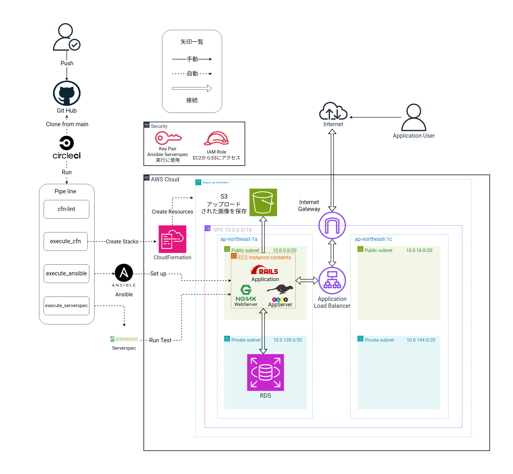

# Railsアプリケーションを CloudFormation Ansible CircleCI を用いて、自動デプロイ&自動稼働し、ServerSpecでインフラ環境を自動テストをする
## 概要

* 下記の構成図のインフラ構成でRailsアプリケーションをAWS上に自動デプロイ&自動稼働し、ServerSpecにてテストをします。
* 今回使用するRailsアプリケーションのデプロイ時のイメージとソースコードは下記を参照にしてください。

[デプロイ時のRailsアプリケーションイメージ](https://lecture13-evdence-app.s3.ap-northeast-1.amazonaws.com/Screen+recording+2024-12-22+21.25.34.webm)

[アプリケーションのソースコード](https://github.com/yuta-ushijima/raisetech-live8-sample-app)

### 構成図


## Railsアプリケーションに使用した言語
* 今回はオンラインプログラミングスクールRaiseTechの講師の方が作成してくださったアプリケーションを使用します。
* エンジニアに向けて書くREADMEを記述する上で必要な事項だと判断しましたので、自作で開発をしていませんが今回掲載させていただきます。

#### 1. Ruby on Rails: バージョン 7.1.3.2
#### 2. HTML: サイトの見た目を構成する
#### 3. CSS: サイトのデザインやスタイルを適用する
#### 4. JavaScript: 動的な要素やインタラクティブな機能を追加する

参考サイト
* [HTMLとCSSを使ってアプリをスタイリングしよう](https://railsgirls.jp/html-and-css)
* [JavaScriptでできること一覧！特徴や他言語との比較も解説](https://career.levtech.jp/guide/knowhow/article/700/)
## Railsアプリケーションに使用しているライブラリの名称とバージョン

### Ruby 
```
3.2.3
```
### Bundler
```
2.3.14
```
### Rails
```
7.1.3.2
```
### Node
```
v17.9.1
```
### Yarn
```
1.22.19
```

## デプロイ時に使用するサーバーの名称とバージョン
### Nginx (WebServer)
```
1.22.1
```
### Puma (ApplicationServer) 
```
6.4.2
```
### RDS (DataBaseServer,DBエンジンはMySQL)
```
# DBエンジンのMySQLのバージョン
8.0.40
```

## デプロイ手順
### 手動デプロイする手順は[こちらを参照](lecture5.md)
### 自動デプロイする手順

1. CircleCIにて環境変数の設定をする

    [設定する環境変数はこちら](lecture13.md)

    **※以後CircleCIのPipelineにて実行します**

2. Cfn-lintにてCloudFormationのテンプレートの構文エラーに異常なしを確認

3. AWS CLIにてCloudFormationのスタックを作成しAWSCloud上にインフラ環境を構築

4. AnsibleにてRailsアプリケーションを自動デプロイするためのプロビジョニング(事前準備処理)を行う

5. ServerSpecにて、テスト項目を実施し、構築・変更されたインフラ環境の自動テストを行う。

[自動デプロイしたリポジトリはこちら](https://github.com/tushiko23/circleci-rails-app)


## オンラインプログラミングスクールRaiseTechでの学習記録

|講義|学習内容|課題内容と記録|備考|
|---|-----|-----|-----|
|第1回|学習のマインドセット<br>AWSアカウント作成<br>IAMユーザの作成・推薦設定<br>Cloud9の作成|ルートユーザーとIAMユーザーをMFA有効化<br>BillingをIAMユーザで閲覧できるように設定<br>Cloud9環境下のRubyにて"HelloWorld"の出力<br>※リポジトリにはなし|AdministratorAccess 権限の IAM ユーザーを作成→以後の課題ではこのIAMユーザを使用します|
|第2回|バージョン管理システム "github"の使い方<br>MarkDown記法|Githubにて、Pull Request の発行と完了報告<br>MergeとCollaboratorへの追加の仕方<br>[lecture2.md](./lecture2.md)|学習記録用リポジトリは今後、[tushima-raisetech-task](https://github.com/tushiko23/tushima-raisetech-task)に記録します|
|第3回|Webアプリケーションが稼働する仕組み<br>APPサーバ・DBサーバ<br>構成管理ツール|Cloud9環境でRailsアプリケーションを手動構築でデプロイ<br>[lecture3.md](./lecture3-images.md)||
|第4回|IAMでの権限管理<br>マネジメントコンソールにてAWS環境手動構築|VPC・サブネットをはじめとするネットワークの構築<br>キーペア・EC2・RDSの作成<br>EC2にSSH接続・EC2からRDSに接続確認<br>[lecture4.md](./lecture-4-modify.md)|今回は、Cloud9環境下からEC2にSSH接続していますが、第5回以降はローカルPCからSSH接続します|
|第5回|EC2にRailsアプリケーションをデプロイ<br>ELBを用いた冗長化・負荷分散<br>S3の役割<br>AWS構成図の作成|EC2にRailsアプリケーションのデプロイ<br>ALB構成を加えて冗長化してデプロイ<br>S3に画像の保存先を変更<br>[lecture5.md](./lecture5.md)|ここからCloud9を使用せずローカルPCを使用|
|第6回|AWSでの証跡、ロギングツール<br>AWSでの監視、通知ツール<br>AWSでのコスト管理ツール|AWSを利用した日の記録をCloudTrailのイベントから抽出<br>CloudWatchアラームにて、ALBのアラーム設定し、メール通知する<br>AWS Pricing CalculatorにてAWS利用料の見積の作成と,AWS Billingを用いて現在の利用料を報告する<br>[lecture6](./lecture6.md)||
|第7回|AWSでのセキュリティ対策|第4・5回で作成した環境で考えられる脆弱性をまとめる<br>[lecture7](./lecture7.md)||
|第8回|ライブコーディング第4回〜第5回①|課題なし 第4回 第5回の復習||
|第9回|ライブコーディング第4回〜第5回②|課題なし 第4回 第5回の復習||
|第10回|インフラ自動化<br>IaCツールCloudFormationの使用|CloudFormationにて、第5回の環境構築<br>(アプリケーションの実装はなし)|同じIaCツールTerraformでの実装は下記参照|
|第11回|テスト駆動開発(TestDrivenDevelopment:TDD)<br>ServerSpecにてインフラ環境を自動テスト|ServerSpecにて第10回で構築したインフラ環境に自動テストを導入して成功させる<br>[lecture11](./lecture11.md)|10回課題で構築したEC2内で実行。SSH接続を使用せずlocalhostでの実行。|
|第12回|IaCツールTerraformの解説<br>DevOpsの考え方について<br>CI/CDツールの使用|CI/CDツールCircleCIを導入する<br>第10回課題内のCloudFormationのテンプレートに対して、cfn-lintを実行するジョブを組み込み成功させる<br>[lecture12](./lecture12.md)|cfn-lintで検出した警告とEOFエラーを解消するためテンプレートを一部修正しています|
|第13回|構成管理(プロビジョニング)ツール<br>Ansibleの導入<br>CI/CDツールCircleCIとの連携|CI/CDツールCircleCI内にCloudFormation,Ansible,ServerSpecのジョブを組み込み,Railsアプリケーションを自動デプロイ&自動稼働とインフラ環境の自動テストを成功させる<br>[lecture13](./lecture13.md)|Ansibleのみでの実行時のコントロールノードはAmazonlinux2022をOSとするEC2を利用。<br>ServerSpecはSSH接続。|
|第14回|ライブコーディング第13回①|READMEの訂正やこれまでの課題の記録を総括し,ポートフォリオの作成||
|第15回|ライブコーディング第13回②|READMEの訂正やこれまでの課題の記録を総括し,ポートフォリオの作成||
|第16回|現場に出るにあたっての必要な技術と知識<br>現場での立ち振る舞い<br>就職・転職で優位に立つために|課題なし <br>転職活動・現場に出るための準備|

