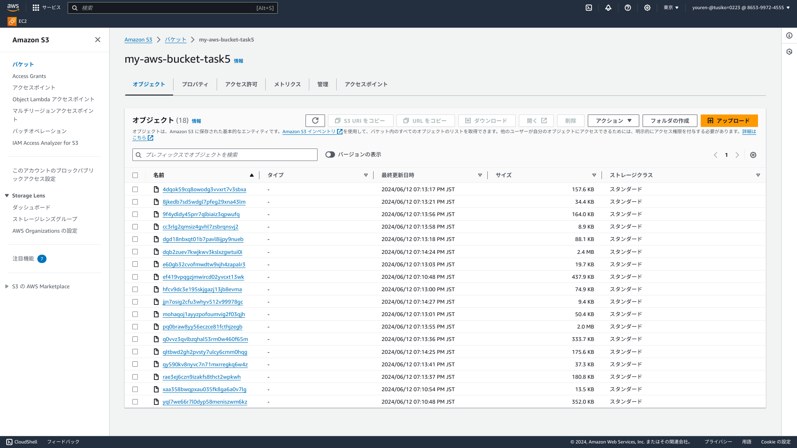

# 第5回課題

## 課題内容

- EC2にサンプルアプリケーション「第3回で使用したもの」をデプロイする 
- ELBを追加して、アプリケーションを動作確認
- S3+ELBを追加して、アプリケーションの動作確認・S3への反映確認
- 上記3つで構築した環境の構成図を作成する

## 確認していただきたいこと

1. [EC2にサンプルアプリケーションをデプロイ](#EC2にサンプルアプリケーションをデプロイ)
- [組み込みサーバ「Puma」のみで動作確認　「3000番ポートを使用」](#組み込みサーバPumaのみでの動作確認)
- [unixソケット通信にて組み込みサーバ「Puma」の動作確認](#unixソケットにて組み込みサーバPumaの動作確認)- 
- [Nginx「Webサーバ」単体での動作確認](#Nginx単体での動作確認)
- [Nginx「Webサーバ」とPuma「Appサーバ」をunixソケット通信でアプリケーションの動作確認](#NginxとPumaをunixソケット通信でアプリケーションの動作確認)

2. [ELB経由でEC2に接続し、サンプルアプリケーションの動作確認](#ELB経由でEC2に接続しサンプルアプリケーションの動作確認)

3. [サンプルアプリケーションの画像保存先をS3に変更して、サンプルアプリケーションの動作確認](#S3に保存先を変更してサンプルアプリケーションの動作確認)

4. [1~3で構築した環境の構成図の作成](#構築した環境の構成図の作成)

5. [感想](#感想)

## EC2にサンプルアプリケーションをデプロイ

### 組み込みサーバPumaのみでの動作確認

- ここまでの作業は[こちら]()から

### unixソケットにて組み込みサーバPumaの動作確認

- ここまでの作業は[こちら]()から

### Nginx単体での動作確認

- ここまでの作業は[こちら]()から

### NginxとPumaをunixソケット通信でアプリケーションの動作確認

- ここまでの作業は[こちら]()から

## ELB経由でEC2に接続しサンプルアプリケーションの動作確認

- ここまでの作業は[こちら]()から

## S3に保存先を変更してサンプルアプリケーションの動作確認

- ここまでの作業は[こちら]()から

## 構築した環境の構成図の作成

## 感想

課題の内容が難しかったですが、なんとか１つ１つの言葉や課題の意図が何なのかを汲みながら完成させることができました!
エラーが出てしまったときに、エラーのメッセージをlogファイルを確認して、いおうとしていることは何なのかを突き止めること、
エラーに対してどうググればできるだけ早く解決にたどり着けるかを常に考えて取り組む必要があると改めて感じさせられました。
今後課題では、gatherで課題が進んでいる方に確認したり、過去の質問の事例からなんとかたどり着きましたが、実際の現場に出ら
れている方にも、質問して解決して自走力をあげる必要があると感じていますので、質問相談所も積極的に活用していく必要がある
と感じました!
