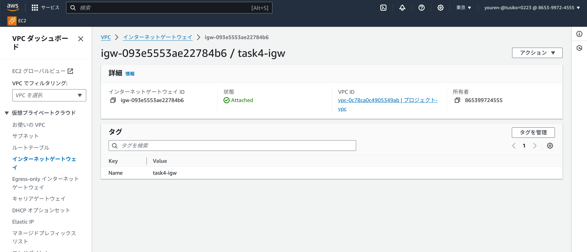
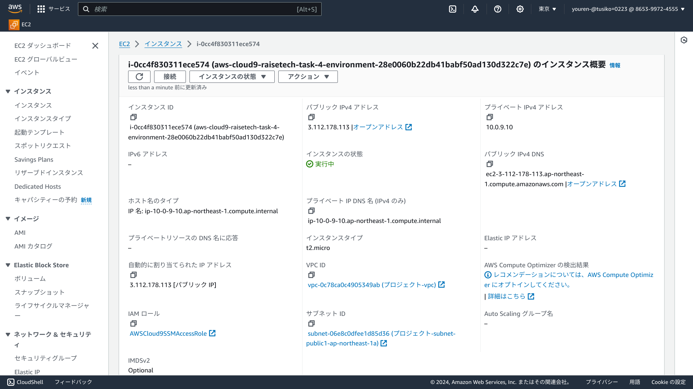

# 第４回課題
* VPCを作成する
* EC2とRDSの構築する
* EC2とRDSを接続し、正常かを確認する

## VPC環境を構築

1. VPC[vpc-0c78ca0c4905349ab]を作成する

2. VPC[vpc-0c78ca0c4905349ab]上にサブネット及びプライベートサブネットを作成
* パブリックサブネット[subnet-06e8c0dfee1d85d36]をアベイラビリティゾーン[ap-northeast-1a]に作成

* パブリックサブネット[subnet-0193c9023cdcc83a0]をアベイラビリティゾーン[ap-northeast-1c]に作成

* プライベートサブネット[subnet-042519ce548990bb8]をアベイラビリティゾーン[ap-northeast-1a]に作成

* プライベートサブネット[subnet-096b2b874c021c394]アベイラビリティゾーン[ap-northeast-1c]に作成

インターネットゲートウェイ[igw-093e5553ae22784b6]を作成し、VPC[vpc-0c78ca0c4905349ab]にアタッチ

* VPC[vpc-0c78ca0c4905349ab]上にパブリックサブネットに関連付けるためのルートテーブル[rtb-01c9953b39c560617]を作成。
* ルートとして送信先10.0.0.0/16でターゲットlocal、追加で送信先0.0.0.0/0をインターネットゲートウェイ[igw-093e5553ae22784b6]をルートに設定。

* ルートテーブル[rtb-01c9953b39c560617]をパブリックサブネット[subnet-06e8c0dfee1d85d36]、[subnet-0193c9023cdcc83a0]に関連付け

* VPC[vpc-0c78ca0c4905349ab]上にプライベートサブネットに関連付けるためのルートテーブル[rtb-042ec775cf927977a]を作成。
* ルートとして送信先10.0.0.0/16でターゲットlocalを設定(デフォルト設定のまま)。

* ルートテーブル[rtb-042ec775cf927977a]をプライベートサブネット[subnet-042519ce548990bb8]、[subnet-096b2b874c021c394]に関連付け

## EC2及びRDSを指定されたVPC環境に構築し、接続するためのセキュリティグループを設定する
※今回はローカルPCは、VPC[vpc-0c78ca0c4905349ab]上のパブリックサブネット[subnet-06e8c0dfee1d85d36]で構築したcloud9のターミナルを使用しec2にSSH接続する。

* VPC[vpc-0c78ca0c4905349ab]上のパブリックサブネット[subnet-06e8c0dfee1d85d36]でcloud9の環境構築[i-0cc4f830311ece574 (aws-cloud9-raisetech-task-4-environment-28e0060b22db41babf50ad130d322c7e]

セキュリティグループに[sg-087a5003e150284cc ]を設定し、cloud9のEC2にアタッチ。

* アウトバウンド[ポート22を接続するec2のセキュリティグループ(sg-0740637188d204c9a)に許可]→ec2にssh接続をするため
* アウトバウンド[ポート3306をRDSのセキュリティグループ(sg-0d60f32112e4c9fc7)に許可]→rdsに接続をするため

* VPC[vpc-0c78ca0c4905349ab]上のパブリックサブネット[subnet-06e8c0dfee1d85d36]でEC2[i-0cc74b4aec470a700]を構築する。

* EC2のセキュリティグループに[sg-07b6d955ba3d37888]を設定し、EC2にアタッチ。
sg-07b6d955ba3d37888の設定
* インバウンド[ポート22を接続をするcloud9のセキュリティグループ(sg-087a5003e150284cc )に許可]→ec2にSSH接続するため

* アウトバウンド[ポート3306をRDSのセキュリティグループ(sg-0d60f32112e4c9fc7)に許可]→rdsに接続するため

