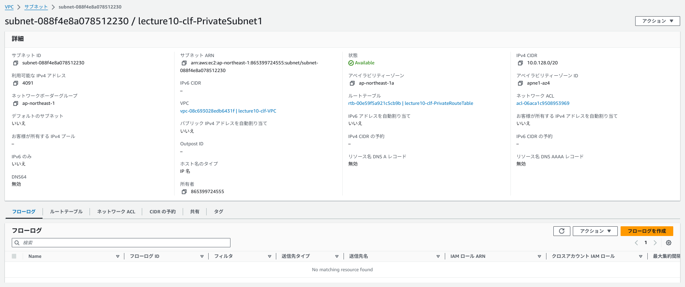
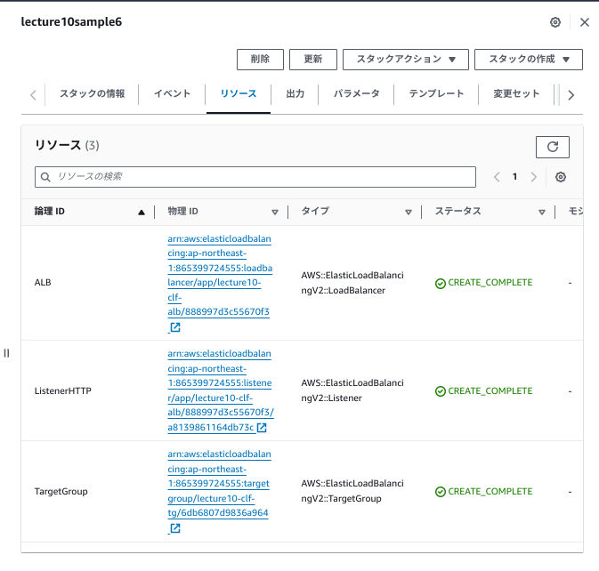
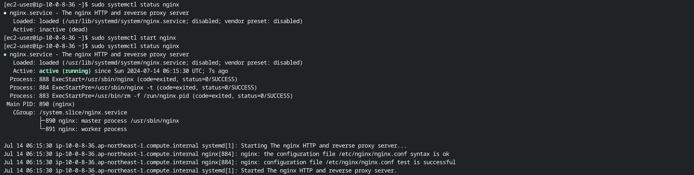

# 第10回課題

## 課題内容
* 第5回課題で構築した環境をCloudFormationでコード化する
* コード化したら、実行し環境が自動で作られることを確認する

## 確認していただきたいこと
1. コード化に使用したYAMLファイルの記述に間違いがないか
2. 自動で作られた環境と5回課題で作成した環境に違いなく正しく構築できているか

## CloudFormationでコード化して環境を作成
今回構築する構成図 (第5回課題で使用したもの)

### ネットワーク環境を構築

コード化したファイルは[こちら](lecture10/lecture10-network.yml)

|構築するリソースの名称|個数|リソースの値|
| ---- | ---- | ---- |
|VPC|1つ  |vpc-08c693028edb6431f / lecture10-clf-VPC|
|IGW|1つ  |igw-075259a45c6b78f6b / lecture10-clf-InternetGateway|
|PublicSubnet|2つ  |subnet-0125a3dd5ba67c765  / lecture10-clf-PublicSubnet1<br> subnet-02c3bf57b62259552/ lecture10-clf-PublicSubnet2|
|PrivateSubnet|2つ|subnet-088f4e8a078512230 / lecture10-clf-PrivateSubnet1<br> subnet-06747c23cbef62d98/ lecture10-clf-PrivateSubnet2|
|RouteTable-PublicSubnet用|1つ|rtb-0d40c9969be0a6d38 / lecture10-clf-PublicRouteTable|
|RouteTable-PrivateSubnet用|1つ|rtb-0d4c1dd18725c374c / lecture10-clf-PrivateRouteTable|

#### 実行し、環境が自動で作られていること確認。
スタックの作成

VPC   

インターネットゲートウェイ 

パプリックサブネット


プライベートサブネット


ルートテーブル(パプリック用)作成&パプリックサブネットに関連付け


ルートテーブル(プライベート用)作成&プライベートサブネットに関連付け


### EC2・RDS・ALBに関連付けるセキュリティグループを作成

コード化したファイルは[こちら](lecture10/lecture10-sg.yml)

#### 実行し、環境が自動で作られていること確認。
スタックの作成
 

|構築するセキュリティグループの名称|用途|セキュリティグループの値|
| ---- | ---- | ---- |
|lecture10-sg01|EC2 |sg-086728c3ddfea28b3|
|lecture10-sg02|RDS|sg-0a83dcca0af6ade24 |
|lecture10-sg03|ALB |sg-02a6e3232247d6f7b|

#### EC2のセキュリティグループ
インバウンド
|タイプ|プロトコル|ポート範囲|ソース|
| ---- | ---- | ---- | ---- |
|HTTP|TCP|80|0.0.0.0/0|
|SSH|TCP|22|マイIPアドレス|

アウトバウンド
|タイプ|プロトコル|ポート範囲|ソース|
| ---- | ---- | ---- | ---- |
|すべてのトラフィック|すべて|すべて|0.0.0.0/0|


#### RDSのセキュリティグループ
インバウンド
|タイプ|プロトコル|ポート範囲|ソース|
| ---- | ---- | ---- | ---- |
|MYSQL/Aurora|TCP|3306|EC2のセキュリティグループ<br>sg-086728c3ddfea28b3|

アウトバウンド
|タイプ|プロトコル|ポート範囲|ソース|
| ---- | ---- | ---- | ---- |
|すべてのトラフィック|すべて|すべて|0.0.0.0/0|


#### ALBのセキュリティグループ
インバウンド
|タイプ|プロトコル|ポート範囲|ソース|
| ---- | ---- | ---- | ---- |
|HTTP|TCP|80|0.0.0.0/0|

アウトバウンド
|タイプ|プロトコル|ポート範囲|ソース|
| ---- | ---- | ---- | ---- |
|すべてのトラフィック|すべて|すべて|0.0.0.0/0|


### EC2を作成

コード化したファイルは[こちら](lecture10/lecture10-ec2.yml)

|名称 | 個数 |リソースの値|
| ---- | ---- | ---- |
|EC2<br>lecture10clf|1つ| i-0fde478caee01e0d3|
|ElasticIP|1つ|13.115.190.98|


今回作成するEC2の明記事項
* SSH接続は、キーペアを用いて行います。今回使用するキーペアはマネジメントコンソールにて事前に作成したものを使用します。
* キーペア名は"lecture10-clf.pem"で、SSH接続する際は、ホームディレクトリ下に配置して使用します。
* EC2インスタンスのOSはAmazonLinux2を使用します。パラメータにて、最新のAMI-IDを取得して構築します。
* 今後の自動化の課題に引き続き使用することを考慮し、ElasticIPを作成し、EC2にアタッチして使用します。

### 実行し、環境が自動で作られていること確認。
スタックの作成

EC2の作成確認と関連付けを確認   


### RDSを作成

コード化したファイルは[こちら](lecture10/lecture10-rds.yml)

|RDSの名称 | 個数 |エンジン|
| ---- | ---- | ---- |
|lecture10-clf-rds|1つ| MySQL Community|

今回作成するRDSの明記事項
* マスタユーザ名・パスワードはパラメータ値を用いて記載します。
* 今回は、MultiAZ構成は取らず、SingleAZ構成で作成します。
* このあと、EC2との接続確認のためMySQLクライアントを手動でlinuxコマンドをたたきインストールします。RDSの動作確認のみのため、mariaDBは削除せず行います。

#### 実行し、環境が自動で作られていること確認。
スタックの作成
   


#### ALBを作成

コード化したファイルは[こちら](lecture10/lecture10-alb.yml)

|名称 | 個数 |リソースの値|
| ---- | ---- | ---- |
|ターゲットグループ|1つ|lecture10-clf-tg|
|ロードバランサー|1つ|lecture10-clf-alb|

今回作成するALBの明記事項
* 今回作成するロードバランサーのリスナーのルールはHTTP・80番で作成します。
* 作成しているロードバランサー及びターゲットグループはWebサーバーのnginxのインストール及び起動していないのでunhealthyになっています。このあと動作確認する際、nginxを起動させ、healthy状態にします。

#### 実行し、環境が自動で作られていること確認。
スタックの作成

ターゲットグループ


ロードバランサー
リッスン80番で作成確認


インスタンスとロードバランサーをターゲットグループに連携させる


#### S3を作成

コード化したファイルは[こちら](lecture10/lecture10-s3.yml)

今回作成するS3の明記事項
* 今回作成するS3には、EC2へのアクセス権限を含んだIAMロール及びバケットポリシーを付与します。
* 今回の作成に使用するIAMユーザーは第1回課題で作成した"AdministratorAccess"をもつIAMユーザーを使用します。
(S3FullAccess権限も含まれます)
#### 実行し、環境が自動で作られていること確認。
スタックの作成


S3のバゲット作成確認及びバケットポリシー付与を確認


IAMロール作成確認


S3バケットに画像がアップロードできるか確認


### 作成したリソースの各種動作確認
EC2インスタンスからのSSH接続


RDSへの接続
```sh
#MySQLクライアントをインストール
sudo yum update
sudo yum install -y mysql
#RDSへ接続
mysql -h [エンドポイント] -P 3306 -u admin -p
```
接続確認


nginxをインストールし、起動し、ALBをhealthy状態にする
```sh
#AmazonLinux2022にnginxをインストール
sudo amazon-linux-extras install nginx1
#nginxを起動し、ALBの状態確認
sudo systemctl start nginx
```
nginxの起動


ALB及びターゲットグループの状態を確認


### 感想
* スタック作成時にyamlファイルから出るエラーメッセージの解読と解決に苦労しました。インデントエラーやOutputの関係値をいつも考えて、何十台、何百台のリソースを構築できるテンプレートにしていきたいです。
* セキュリティグループで片方を"SourceSecurityGroupId"にもう片方"DestinationSecurityGroupId"に設定すればお互いのセキュリティグループを設定できることがわかり勉強になりました。
<br>※例えばEC2のアウトバウンドに3306ポートでソースをRDSのsgにする・RDSのインバウンドで3306ポートでソースをEC2のsgにする場合

* 今回の課題提出でyamlファイルを1つにするか、複数に分けて提出するかどうするか迷いました。結果的に、①リソースの組み合わせが容易にできる。②複数人で開発する際、リソース担当分をいち早く渡せるという観点から今回は複数に分けて提出を選択させていただきました。
<br>課題を完走されて現場に出られている方から、1つの場合も複数の場合もメリット・デメリットがあるから考えてケースバイケースで作成するといいとアドバイスいただいたのでどちらが適切かを仮説をたてたうえで現場ではどうするかも考えて行きたいと思います。


