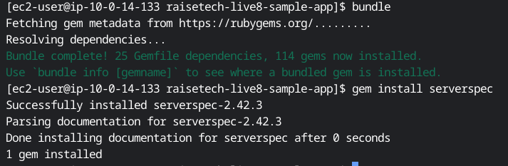
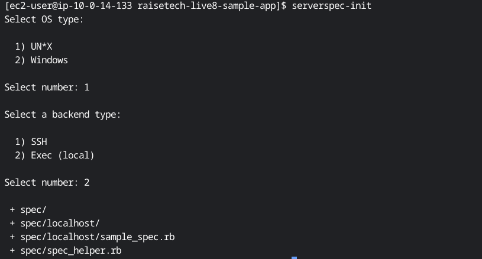
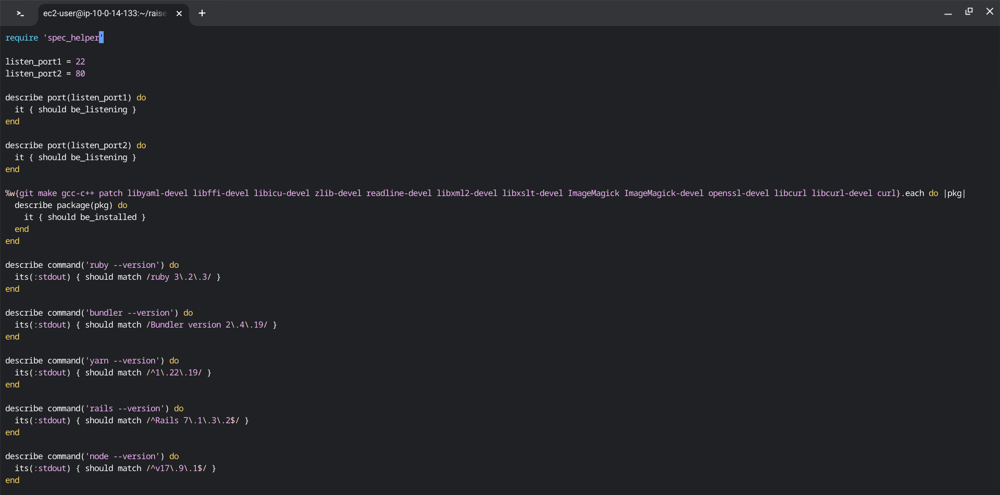
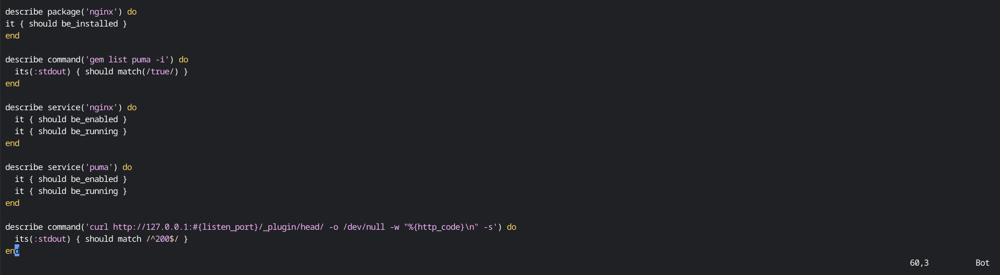
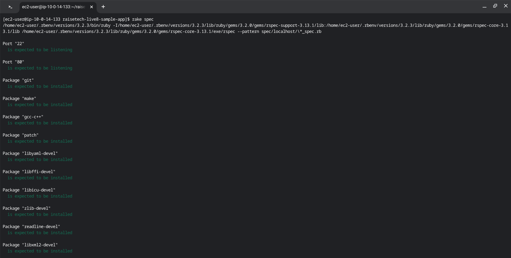
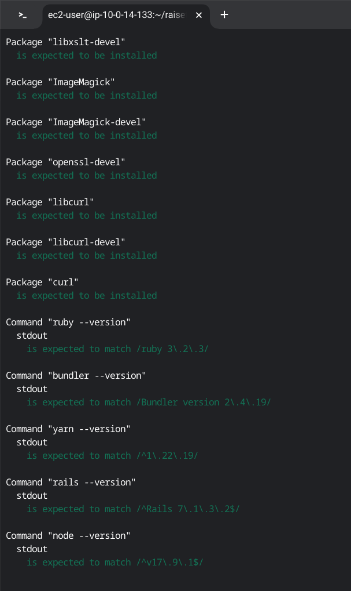
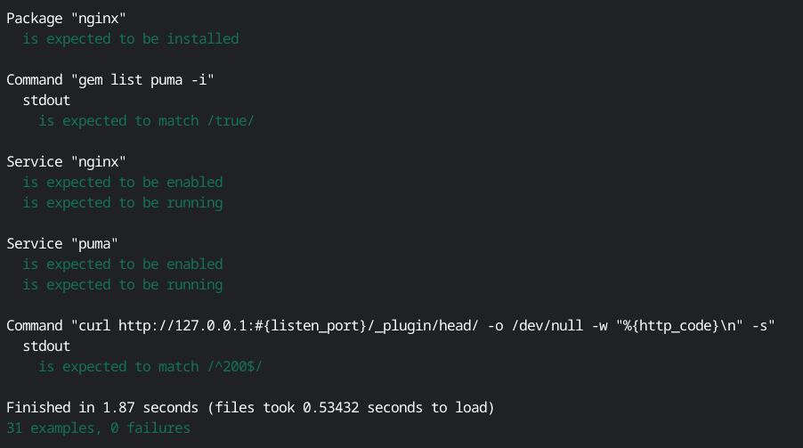

# 第11回課題

## 課題内容
* 第5回課題で構築した環境にServerSpecを導入しテスト成功を確認する
* 今回の課題では、AWSリソースの作成はCloudFormationのテンプレートで自動構築し、動作環境のインストール及びRailsアプリケーションのデプロイは手動構築でするものとする。

## 確認していただきたいこと
1. ServerSpecのテスト項目及びテストコードは適切か
2. ServerSpecのテスト項目は成功しているか

## ServerSpecでテストする
### ServerSpecのインストール及び自動テスト実施環境を整える
[公式ページ](https://serverspec.org/)を元に作成

* ServerSpecのインストール
```sh
#GemFileにServerSpecを追加
gem 'serverspec'
#bundleを実行
bundle
#GemでServerSpecをインストール
gem install serverspec
```


* 環境に応じたテストスクリプトを作成

```
serverspec-init

Select OS type:

  1) UN*X
  2) Windows

#OSタイプAmazonLinux2なので1を選択
Select number: 1

Select a backend type:

  1) SSH
  2) Exec (local)
 
#自ら構築したサーバーをローカルマシンとしてテストを実行するので2を選択
Select number: 2

 + spec/
 + spec/localhost/
 + spec/localhost/httpd_spec.rb
 + spec/spec_helper.rb
 + Rakefile
```


レポジトリ構成

```
├── Rakefile
├── spec
│   ├── localhost
│   │   └── sample_spec.rb
│   └── spec_helper.rb
```

### spec/localhost/配下のsample_spec.rbにテスト項目を編集・追加する
[第11回分事前テストサンプル分](https://github.com/MasatoshiMizumoto/raisetech_documents/tree/main/aws/samples/serverspec)を元に作成




テスト項目

1. ポート22番・80番がリッスン（通信待ち受け状態）であるか

2. アプリケーションのデプロイに必要なパッケージ(下記参照)がインストールされているか
```sh
git make gcc-c++ patch libyaml-devel libffi-devel libicu-devel zlib-devel readline-devel libxml2-devel libxslt-devel ImageMagick ImageMagick-devel openssl-devel libcurl libcurl-devel curl webpack webpackcli
```
* webpack webpackcliはnpmでインストールしたので、npm内のリストにwebpack webpackcliがあるかを確認するテストを実施することで、インストールを確認する

3. 必要動作環境がそれぞれインストールされているか、指定したバージョンになっているか
```sh
ruby     3.2.3　
bundler  2.3.14
yarn     1.22.19
rails    7.1.3.2
node     v17.9.1
```

4. nginx・pumaがインストールされているか

* pumaはrubyのGemとしてインストールされているので、Gem内のリストにpumaがあるかを確認するテストを実施することで、インストールを確認する

5. nginx・pumaがEC2起動時に自動起動されるか、起動状態であるか

6. テスト接続して動作するか

   ※curlでHTTPアクセスをして200番を返すテストを行うことで確認する


### テスト結果

エビデンス画像6




感想
* 手動構築のときは、ポートの確認や動作環境のバージョン確認をマネジメントコンソールやコマンドで確認していましたが、serverspecを導入したことでテストを自動で実行でき省力化もできるので、現場でも要件によってテストをより正確に、時間をかけずにできるかを考えて導入したいです。
* 同じ自動テストツールとしてawspecもあることも知りました。awsのリソースも場合によってはテストする場合が出てくると思うので、この機会に触れてテストを実行できるようになりたいです。
* テストコードの記述が指定するOSやバージョンを正確にテストするために正規表現を使って記述することがわかりました。動作環境によって正規表現を使うべきなのかをしっかり考えて活用したいと思います。