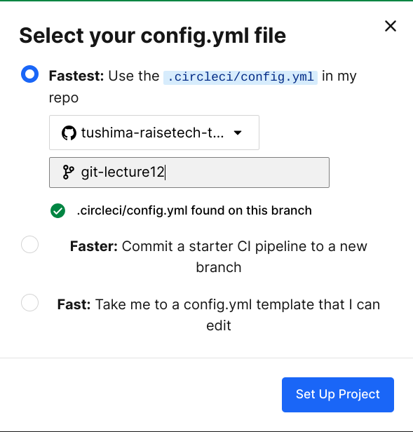
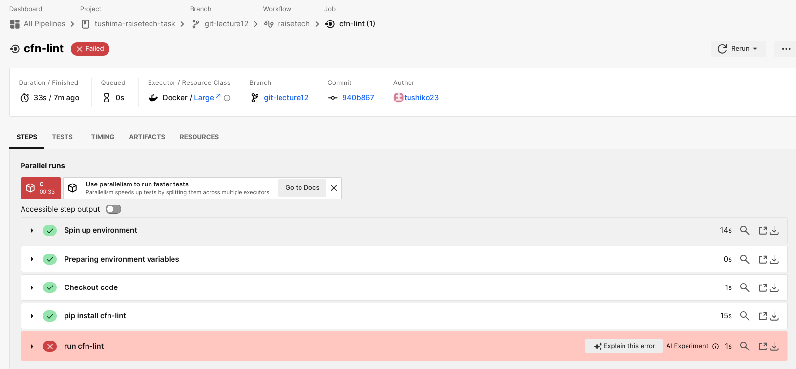
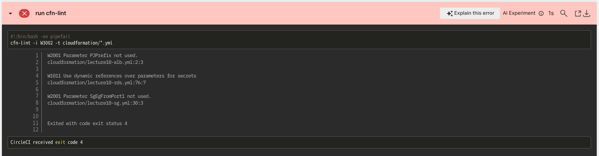
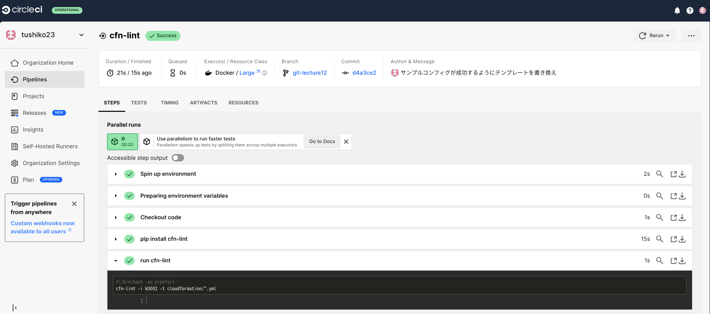
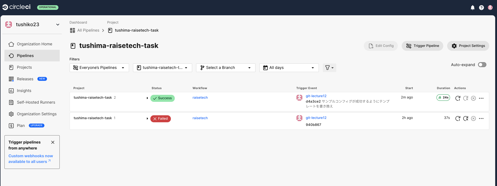
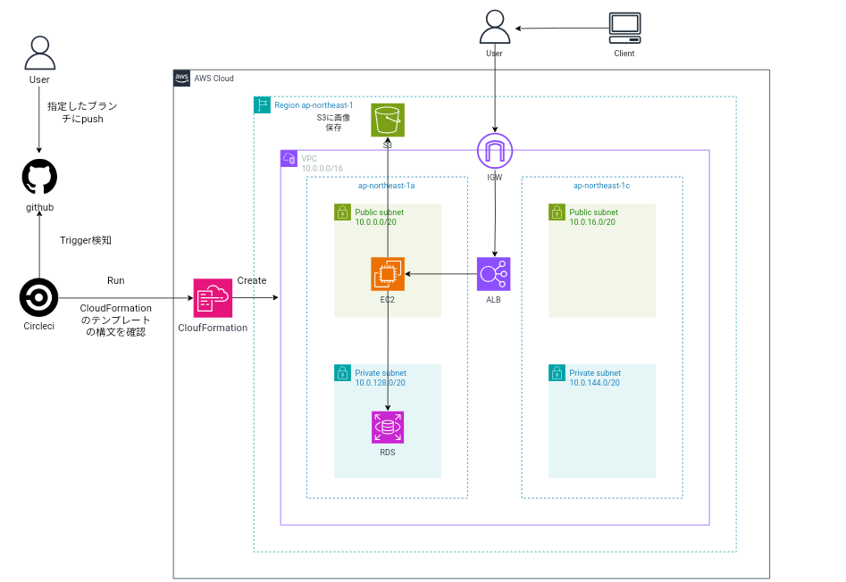

# 第12回課題

CI/CDツールCircleCIを導入し、提供されたサンプルコンフィグが動作するか確認する。

[提供されたサンプルコンフィグはこちら](https://github.com/MasatoshiMizumoto/raisetech_documents/tree/main/aws/samples/circleci)

[サンプルコンフィグの内容についてはこちら](./lecture12/reference.md)

### 事前準備
1. Circleciとgithubを連携させる

[参考サイト](https://www.techpit.jp/courses/78/curriculums/81/sections/615/parts/2086)

2. トリガーの設定
* 今回は、課題提出用のレポジトリ`tushima-raisetech-task`で確認します。
* 新たに、cloudformationディレクトリを作成し、第10回課題でレビューいただいたcloudformationのテンプレートを配置します。
* イベントトリガータイミングは、ブランチ`git-lecture12`がpushされたときにcfn-lintでCFnの構文を確認します。



## 動作確認結果

### 1. 1回目の確認→failed(失敗が表示)





failedの原因→警告コードW2001,W1011,W2001が出ているため。

改善方法
  1. CloudFormation内のテンプレートを修正し、再度動作確認。
  2. run cfn-lint内に-iオプションを追加して、警告コードを指定し、検知無視して動作確認する。

今回は、警告コードとテンプレートの中身を確認し照らし合わせた結果、1の方法を選択しました。

警告コードの内容と対処方法

* 警告コードW2001
```
W2001 Parameter PJPrefix not used.
cloudformation/lecture10-alb.yml:2:3
```
lecture10-alb.ymlの2行目のパラメータ`PJPrefix`が使われていない

→確認した結果、出力通り使われていなかったので、コメントアウトして削除した。

* 警告コードW1011
```
W1011 Use dynamic references over parameters for secrets
cloudformation/lecture10-rds.yml:76:7

# cfn-lint --list-rules コマンドより
Instead of REFing a parameter for a secret use a dynamic reference. Solutions like SSM parameter store and secrets manager provide better security of sercrets
```
lecture10-rds.yml:76で機密情報のために動的参照を使ってください。
SSMパラメータやsecretsmanagerのような解決方法は機密情報の安全性をよくしてくれます

→テンプレート内で直接参照ではなく、SecretsManagerの動的参照を使用する記述に改善しました。RDS作成時にSecretsManagerによってマスタパスワードを生成して、取得します。
```
# 以下の記述をコメントアウトしました
# DBPassword: 
  #  Type: String
  #  Default: "DBpassword"
  #  NoEcho: true
  #  MinLength: 8
  #  MaxLength: 41
  #  AllowedPattern: "[a-zA-Z0-9]*"
  #  ConstraintDescription: "[must contain only alphanumeric  ]"
  #  characters."

DBInstance: 
    Type: "AWS::RDS::DBInstance"
    Properties: 
# 以下のパスワードの直接参照をコメントアウト
# MasterUserPassword: !Ref DBPassword

# この部分をSecretsManagerで管理するように設定するため以下をコメントイン。
# RDSとSecretsManagerは統合されたため、こちらのみでOK。

ManageMasterUserPassword: true
```

[参考記事](https://zenn.dev/devcamp/articles/54ffd860025f64)

* 警告コードW2001
```
W2001 Parameter SgEgFromPort1 not used.
cloudformation/lecture10-sg.yml:30:3
```
lecture10-sg.ymlの30行目のパラメータ`SgEgFromPort1`が使われていない

→確認した結果、`SgIngFromPort3`同じ記述がされていて、`SgEgFromPort1`が使われていなかったので１つをコメントアウトして削除しました。 

* なお、第10回課題でCloudFormationの略称を’clf’と誤用していたため、テンプレートの一部を'CFn'に変更しています。

### 2. 2回目の確認→Success(成功が表示)





### 構成図

* CloudFormationのcreateは第13回以降課題で実装します。

 

### 感想
* CI/CDツールを使用して、トリガーを指定して自動でコマンドを実行したり、構文を確認できることがわかりました。orbsを利用して、必要な環境を指定して、ローカルに開発環境がなくてもジョブを自動実行できることを学びました。13回以降では、CLIやansibleの環境をorbsに指定してジョブを定義すると思うので、orbsの指定はちゃんとやっていきたいと思います！

* cfn-lintはvscodeの拡張子でvscode上でインストールするだけで自動実行できると思い込んでいたので、vscodeの開発環境でcfn-lintが動作せず、使われていないパラメータが検出されて動作が失敗するという事象が起きました。vscodeの拡張機能を使うときはちゃんと環境上で動作することを確認して使用したいです。

* debian環境のlinuxではpip3でcfn-lintをインストールするのに、-m venvコマンドで任意のパスに仮想環境を作成して有効化してインストールすることを学びました。Python環境が「（externally-managed environment）外部管理環境」として設定されているため、pipでPython環境全体にインストールしようとしたら制限がかかりました。仮想環境を作成するのに最初わからずでしたが、１つ１つ英文を読んで、参考記事・サイトを探したら見つかったので備忘録としてまとめておきたいと思います。

* ジョブやワークフローで名前を何をしたかわかりやすいものに定義しておくとどこが成功して、どこが失敗したかがわかるので、自分でもレビュー側もわかりやすいものをつけて特定できるようにしたいです。
