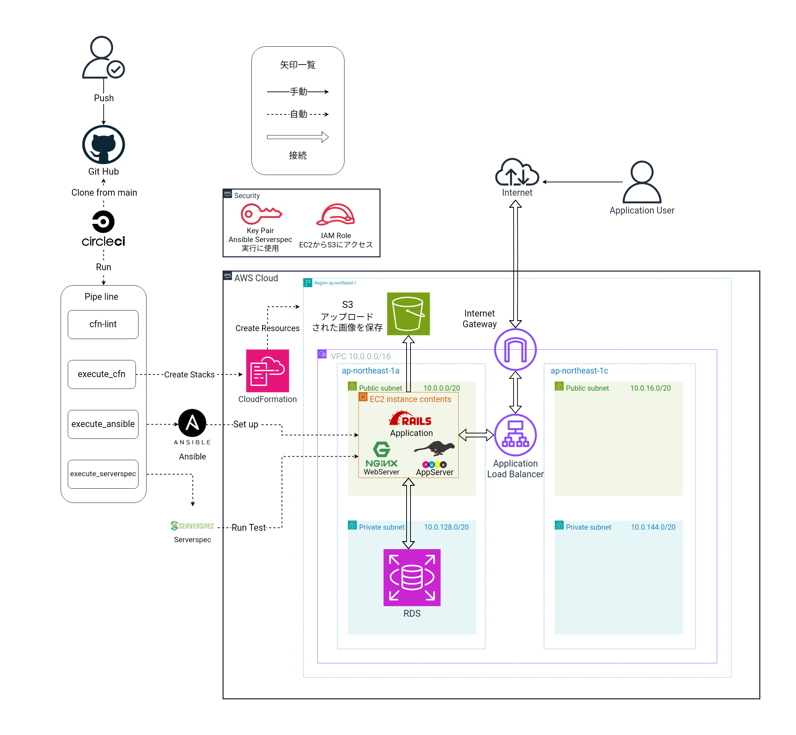

# 第13回課題
## 課題内容
CloudFormationとAnsibleとCircleCIでRailsアプリケーションの自動デプロイを行い,ServerSpecでアプリケーションのデプロイサーバに指定のテストをして成功することを確認する

今回自動化に使用したレポジトリ
[circleci-rails-app](https://github.com/tushiko23/circleci-rails-app)

今回デプロイする簡単なCRUD処理ができるRailsアプリケーション


[Railsアプリケーションのソースコード](https://github.com/yuta-ushijima/raisetech-live8-sample-app)

### 構成図



### ディレクトリ構成
```
.
├── .circleci
│   └── config.yml
├── Ansible
│   ├── aws_ec2.yml
│   ├── playbook.yml
│   ├── vars.yml ※ CircleCI内のジョブで生成
│   └── roles
│       ├── alb_config_hosts_role
│       │   └── tasks
│       │       └── main.yml
│       ├── app_source_role
│       │   └── tasks
│       │       └── main.yml
│       ├── bundler_install_role
│       │   └── tasks
│       │       └── main.yml
│       ├── db_server_role 
│       │   └── tasks
│       │       └── main.yml
│       ├── image_magick_config_role
│       │   └── tasks
│       │       └── main.yml
│       ├── mysql_install_role
│       │   └── tasks
│       │       └── main.yml
│       ├── nginx_conf_role
│       │   ├── tasks
│       │   │   └── main.yml
│       │   └── templates
│       │       └── nginx.conf
│       ├── nginx_server_role
│       │   └── tasks
│       │       └── main.yml
│       ├── node_install_role
│       │   └── tasks
│       │       └── main.yml
│       ├── ping_check_role
│       │   └── tasks
│       │       └── main.yml
│       ├── puma_server_role
│       │   └── tasks
│       │       └── main.yml
│       ├── rails_install_role
│       │   └── tasks
│       │       └── main.yml
│       ├── ruby_install_role
│       │   └── tasks
│       │       └── main.yml
│       ├── s3_config_role
│       │   └── tasks
│       │       └── main.yml
│       ├── set_up_role
│       │   └── tasks
│       │       └── main.yml
│       ├── template_db_server_role
│       │   ├── tasks
│       │   │   └── main.yml
│       │   └── templates
│       │       └── database.yml
│       ├── webpack_install_role
│       │   └── tasks
│       │       └── main.yml
│       ├── yarn_install_role
│       │   └── tasks
│       │       └── main.yml
│       └── yum_packege_role
│           └── tasks
│               └── main.yml
├── ansible.cfg
├── lecture13
│   ├── project-1.yml
│   ├── project-2.yml
│   ├── project-3.yml
│   ├── project-4.yml
│   ├── project-5.yml
│   └── project-6.yml
├── README.md
└── serverspec
    ├── Gemfile
    ├── Gemfile.lock
    ├── Rakefile
    └── spec
        ├── spec_helper.rb
        └── target
            └── sample_spec.rb

48 directories, 37 files
```
### ソースコードをCloneして使用するうえでの準備事項

1. リソースの準備
* AWSアカウント
*  CloudFormationとAWSCLI、各リソース(VPCなどのネットワーク,EC2,RDS,S3)にアクセス権限をもつユーザー。
   →今回はAdministrator権限があるIAMユーザを使用します
* IAMアクセスキーとIAMアクセスキーIDの作成。
[参考サイト](https://en-junior.com/create_access_key/)
* キーペアの作成→マネジメントコンソールで作成。
* <任意>:Circleciの有料プランで与えられる"CircleCIのジョブで使用するIPアドレス"
[参考](https://circleci.com/docs/ja/ip-ranges/)

2. CircleCI内で環境変数の設定とSSHKeyの設定


表

(今回は、無料枠でのデプロイになるのでsgに設定するSSH22番ポートのインバウンドルールのMYIPは0.0.0.0/0とします。現場やプロジェクトでは有料版で与えれるIPを確認して×.×.×.×/32を設定してください)

logの場所
webserver[nginx] error.log: /var/
appserver[puma] raistech-live8-sample-app/log/

### 実行結果の確認

自動化処理が完了したエビデンス画像

Circleciのジョブ成功画像　
つながり
CFn Ansible Serverspec・

CFnのスタック処理画像・

アプリケーションの表示を確認

画像の保存がS3に転送を確認・


