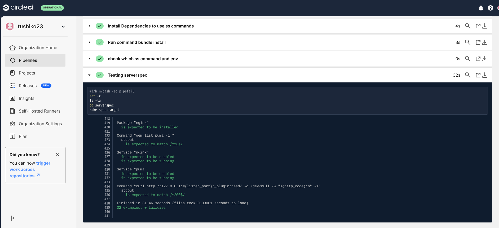
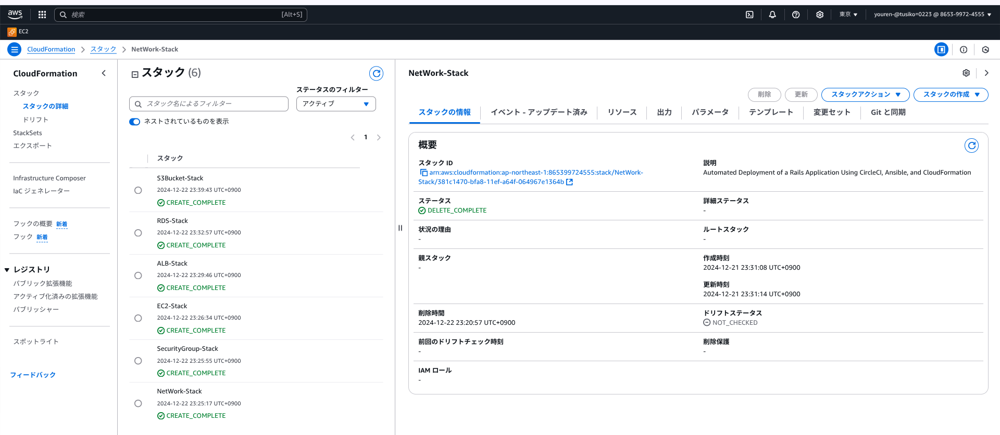

# 第13回課題
## 課題内容
CloudFormationとAnsibleとCircleCIでRailsアプリケーションの自動デプロイを行い,ServerSpecでアプリケーションのデプロイサーバに指定のテストをして成功することを確認する

今回自動化に使用したレポジトリ→[circleci-rails-app](https://github.com/tushiko23/circleci-rails-app)

今回デプロイする簡単なCRUD処理ができるRailsアプリケーション

[アプリケーションの操作映像はこちら](https://lecture13-evdence-app.s3.ap-northeast-1.amazonaws.com/Screen+recording+2024-12-22+21.25.34.webm)

[Railsアプリケーションのソースコード](https://github.com/yuta-ushijima/raisetech-live8-sample-app)

### 構成図


### ディレクトリ構成
```
.
├── .circleci
│   └── config.yml
├── Ansible
│   ├── aws_ec2.yml
│   ├── playbook.yml
│   ├── vars.yml ※ CircleCI内のジョブで生成
│   └── roles
│       ├── alb_config_hosts_role
│       │   └── tasks
│       │       └── main.yml
│       ├── app_source_role
│       │   └── tasks
│       │       └── main.yml
│       ├── bundler_install_role
│       │   └── tasks
│       │       └── main.yml
│       ├── db_server_role 
│       │   └── tasks
│       │       └── main.yml
│       ├── image_magick_config_role
│       │   └── tasks
│       │       └── main.yml
│       ├── mysql_install_role
│       │   └── tasks
│       │       └── main.yml
│       ├── nginx_conf_role
│       │   ├── tasks
│       │   │   └── main.yml
│       │   └── templates
│       │       └── nginx.conf
│       ├── nginx_server_role
│       │   └── tasks
│       │       └── main.yml
│       ├── node_install_role
│       │   └── tasks
│       │       └── main.yml
│       ├── ping_check_role
│       │   └── tasks
│       │       └── main.yml
│       ├── puma_server_role
│       │   └── tasks
│       │       └── main.yml
│       ├── rails_install_role
│       │   └── tasks
│       │       └── main.yml
│       ├── ruby_install_role
│       │   └── tasks
│       │       └── main.yml
│       ├── s3_config_role
│       │   └── tasks
│       │       └── main.yml
│       ├── set_up_role
│       │   └── tasks
│       │       └── main.yml
│       ├── template_db_server_role
│       │   ├── tasks
│       │   │   └── main.yml
│       │   └── templates
│       │       └── database.yml
│       ├── webpack_install_role
│       │   └── tasks
│       │       └── main.yml
│       ├── yarn_install_role
│       │   └── tasks
│       │       └── main.yml
│       └── yum_packege_role
│           └── tasks
│               └── main.yml
├── ansible.cfg
├── lecture13
│   ├── project-1.yml
│   ├── project-2.yml
│   ├── project-3.yml
│   ├── project-4.yml
│   ├── project-5.yml
│   └── project-6.yml
├── README.md
└── serverspec
    ├── Gemfile
    ├── Gemfile.lock
    ├── Rakefile
    └── spec
        ├── spec_helper.rb
        └── target
            └── sample_spec.rb

48 directories, 37 files
```
### ソースコードをCloneして使用するうえでの準備事項

1. リソースの準備
* AWSアカウント
*  CloudFormationとAWSCLI、各リソース(VPCなどのネットワーク,EC2,RDS,S3)にアクセス権限をもつユーザー。
   →今回はAdministrator権限があるIAMユーザを使用します
* IAMアクセスキーとIAMアクセスキーIDの作成。
[参考サイト](https://en-junior.com/create_access_key/)
* キーペアの作成→マネジメントコンソールで作成。
* <任意>:Circleciの有料プランで与えられる"CircleCIのジョブで使用するIPアドレス"
→[参考](https://circleci.com/docs/ja/ip-ranges/)

2. CircleCI内で環境変数の設定とSSHKeyの設定

環境変数


|Environment Validatesの名称|設定値|備考|
| ---- | ---- | ---- |
|AWS_ACCESS_KEY_ID|作成時出力した値|AWSCLI&CFnで使用|
|AWS_DEFAULT_REGION|ap-northeast-1|東京リージョン|
|AWS_SECRET_ACCESS_KEY|作成時出力した値|AWSCLI&CFnで使用|
|KEY_PAIR_NAME|作成したキーペア名|EC2に関連付け|
|MY_IP|×.×.×.×/32|CircleCIで与えられるIPを使用|
|S3_BUCKET_NAME|自身で設定|AWSCFnで使用|

* (今回は、CircleCI無料枠での実行となるので環境変数のMYIPは0.0.0.0/0とします。現場やプロジェクトでは有料版で与えられるIPを確認して×.×.×.×/32を設定してください)

SSHKeys


* Ansible及びServerSpecの実行の際に使用

3. その他
#### 実行環境

* 今回は**development環境**を想定してデプロイします。
* RailsのアセットコンパイルやS3の設定はtest,production環境に応じてファイルのPATHやコマンド実行が異なりますのでご注意ください。 

#### logの場所

WebServer[nginx] 
 * error.log: /var/log/nginx/error.log 
 * access_log  /var/log/nginx/access.log

AppServer[puma] 
 * raistech-live8-sample-app/log/
 * development,production,test環境に応じてlogファイルが変わるので,環境に応じて確認してください

### 実行結果の確認

[処理結果のURL](https://app.circleci.com/pipelines/github/tushiko23/circleci-rails-app/227/workflows/0ac6a4f8-6bb3-4832-8d88-9ae5efad2a13)

* 自動化処理が完了したエビデンス画像

* CFn-lintのジョブ成功画像　

* CFnの成功

* Ansibleの成功
 
* ServerSpecの成功

* コンソール上でCFnのスタック作成・

* アプリケーションの表示を確認

* 画像の保存がS3に転送を確認・


### 感想
* Ansibleの実行では,line-in-fileモジュールの正規表現で指定された行に設定を加えるところや,rubyのインストールとpumaの起動に苦労しました。エラーが出た際は,手動構築でターゲットノードで同じ実行ができるかを確認する、エラーになったら手動構築の際でやった方法をやって解決できるかどうかを確認して,Ansibleに落とし込んでテストしていくことで解決していくことを学びました!正規表現やlinuxのコマンド,shellに関してはまだ理解が浅いので、この課題後も重点的に取り組んでいきたいです！
* CircleCIへのジョブ追加で苦労したところは,CFnで作成した動的値の取得とAnsible/ServerSpecのSSH接続,Pumaの起動とアプリケーションの表示に苦労しました。Ansibleのダイナミックインベントリを使用するところから必要なパッケージがPythonとpipのバージョンを合わせないと入らなかったり,Ansible.cfgの配置場所によって優先的に適用されなかったりしてSSHができなかったりしました。また,何度か実行するとジョブが失敗したりタイムアウトになるところをregister変数で状況に応じて、skipしたりインストールしたり設定も加えたので一度の実行だけでなく複数回実行した際のことも考えて実行していきたいです。
* エラー原因が出たときの英語の解釈がうまくできなかったり,英語記事を読むことができればもっとエラーや警告に対して適切に対処できると思うので、技術の勉強の他に英語の勉強もこれからできればと思います!
