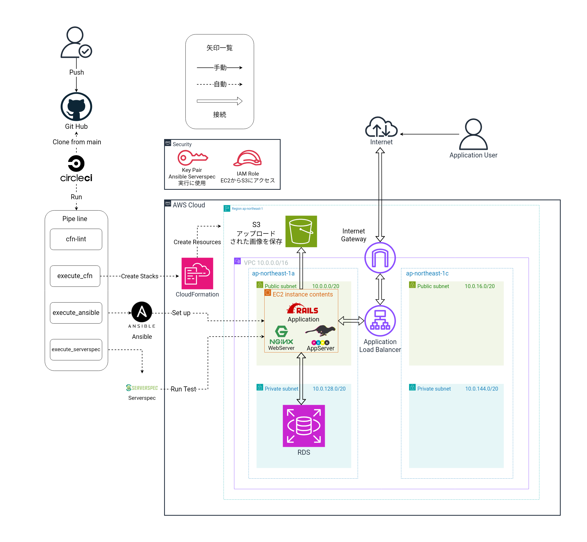

# READMEの別冊
## 概要
* 下記の構成図のインフラ構成でRailsアプリケーションを自動デプロイ&自動稼働し、ServerSpecにてテストをします。

## 構成図

## 自動化構成の解説
### 1. **IaC（Infrastructure as Code)**  →**CloudFormation**

* 役割:Railsアプリケーションをデプロイ&稼働させるインフラストラクチャをAWS内に構築する

### 2. **構成管理(プロビジョニング)ツール** → **Ansible**

* 役割: ターゲットノード(今回はEC2)にRailsアプリケーションのデプロイ&稼働に必要な環境構築、設定や変更を加える。

### 3. **CI/CDツール(Continuous Integration/Continuous Delivery)** → **CircleCI**
* 役割:  ソフトウェアの開発プロセス(今回は,CloudFormation,Ansible,ServerSpecの実行及び更新)において、コードの変更を常にテストし、自動で本番環境に適用する。

## インフラ構成の解説

### 1. EC2
* 役割: 汎用的な仮想サーバで、WebServerであるNginxとApplicationServerであるPumaを稼働させる ※ 今回は、簡単な構成でインフラ構成をわかりやすくする+コストを抑えるという理由で1台のインスタンスにNginxとPumaを稼働させています。

### 2. RDS
* 役割: RailsアプリケーションのDataBaseServerとして使用する

### 3. ALB
* 役割: Railsアプリケーションの冗長化・リクエストの負荷分散

### 4. S3
* 役割:Railsアプリケーションの画像の保存先に設定する
