# 第3回課題提出の内容とエビデンス画像

## サンプルアプリケーションの起動画像

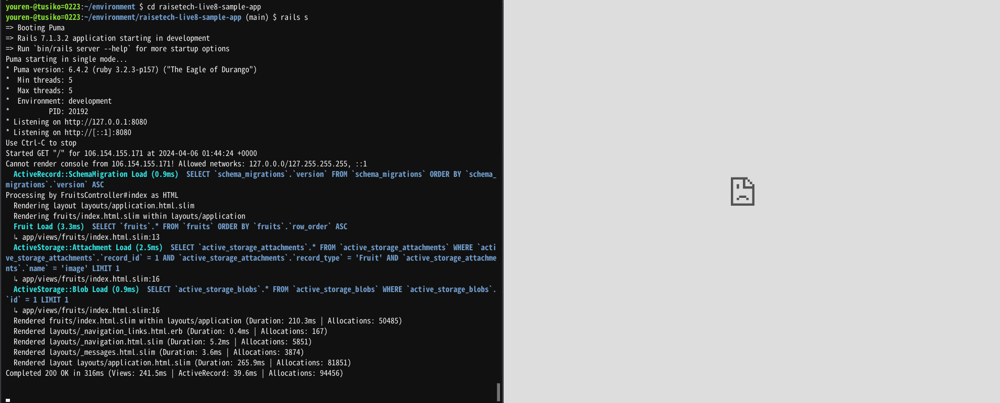　
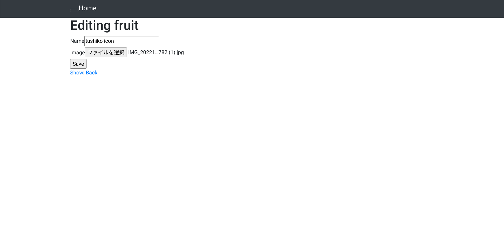

## APサーバに関して
1. APサーバの名前→puma   バージョン6.4.2

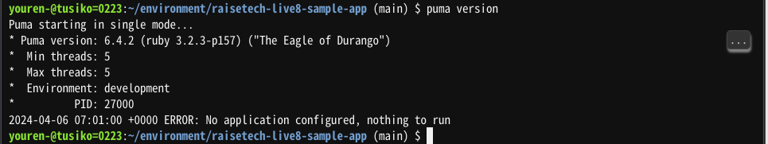
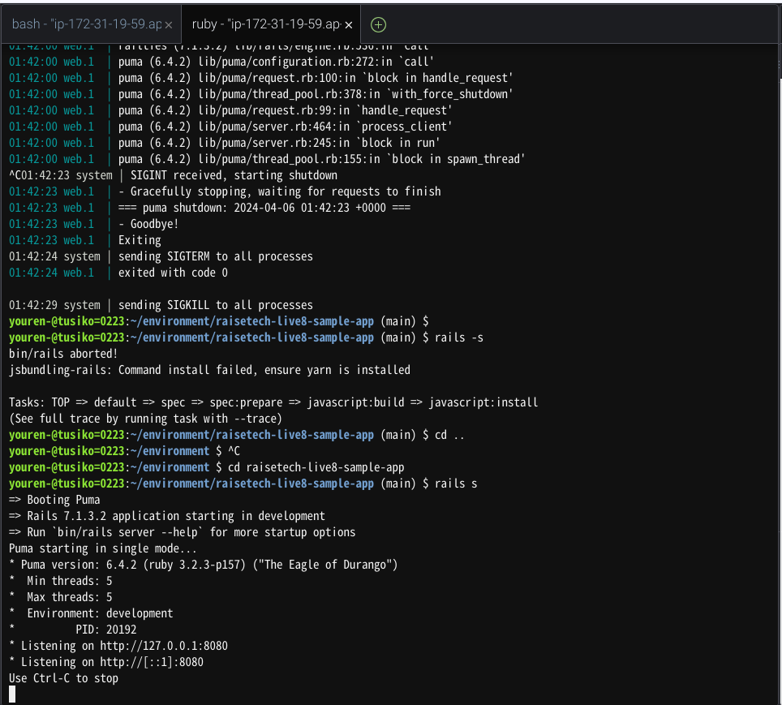
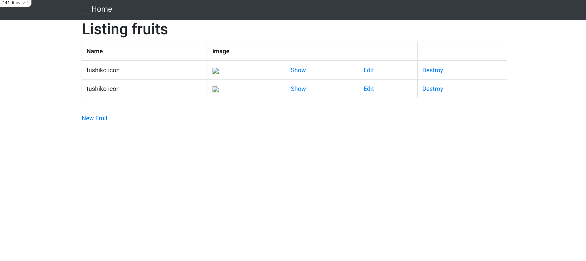
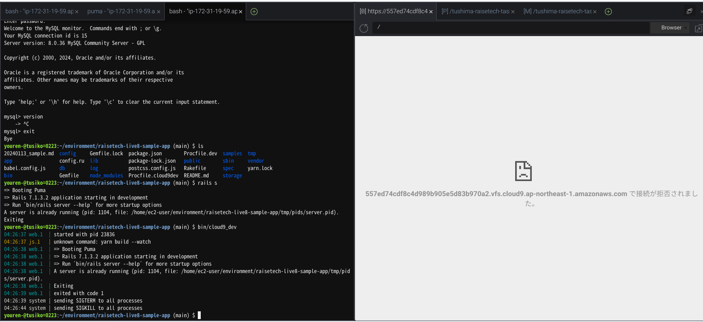
2. アクセスを終了させた場合→アクセスできない

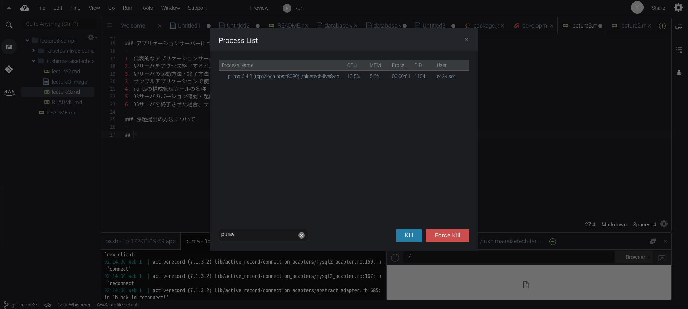
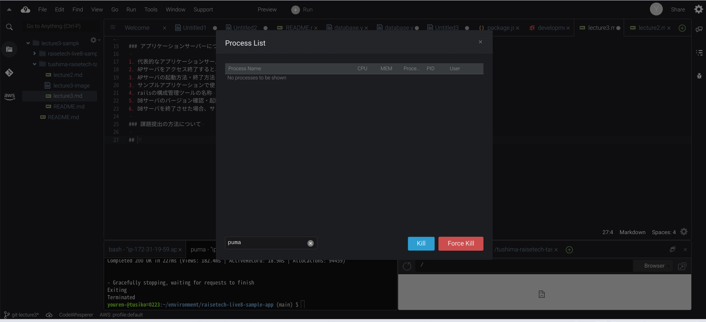
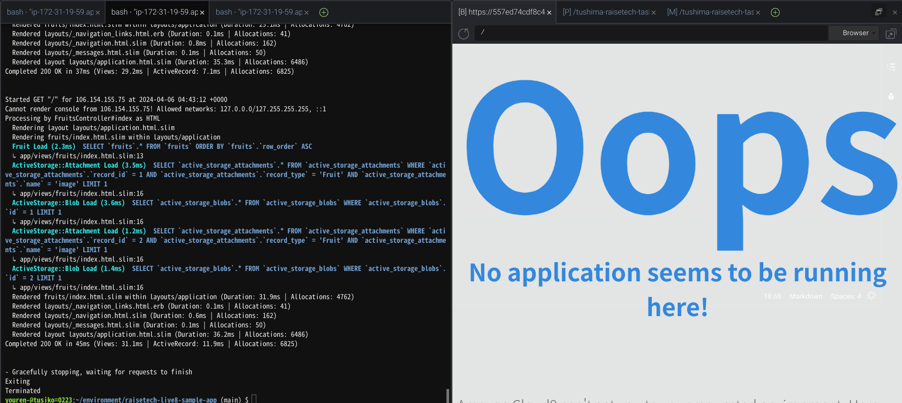

## DBサーバに関して
1. DBサーバの名前→mysql  バージョン8.0.36
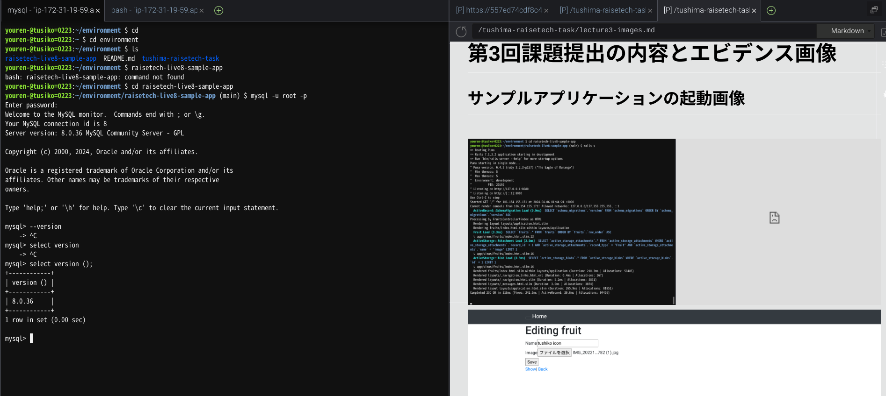
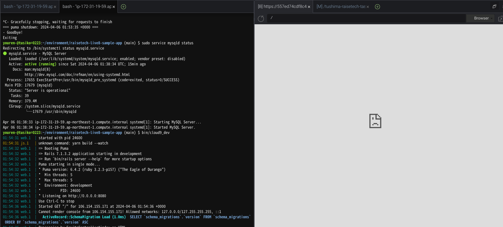

2. アクセスを終了させた場合→アクセスできない
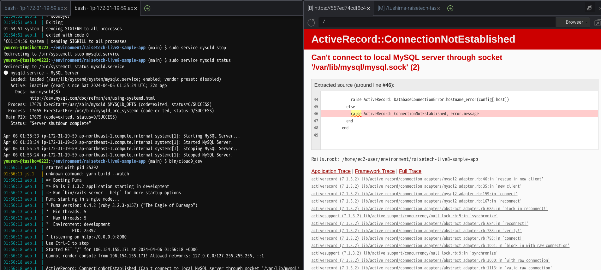
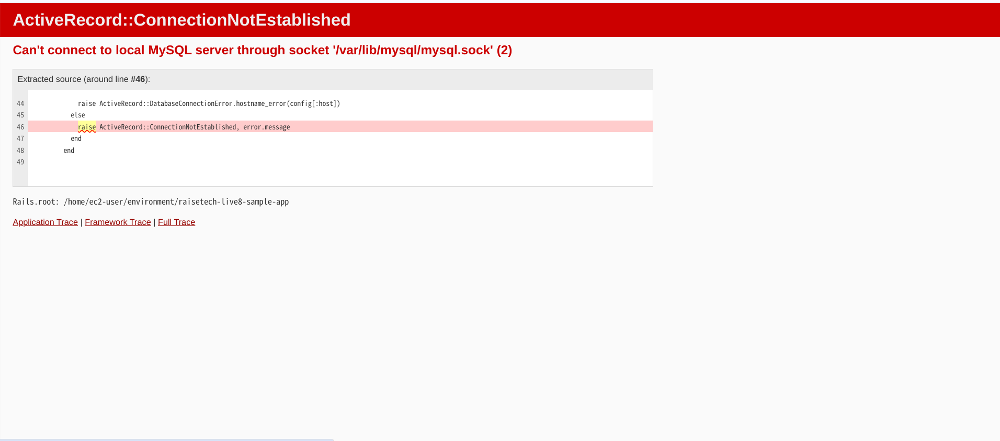

3. Railsの構成管理ツール→ bundler
* Railsにおけるgemとbundlerについてどんな役割を果たすのかもう一度調べました。
* 結果、gemはrailsを動かすためのアプリケーション、フレームワークをパッケージ化したものでbundlerはそれに対して、gemが正常に作動するためのバージョンやプログラムと言った構成を管理するツールとわかりました。
* 従って、Railsの構成管理ツールはbundlerといえます。

