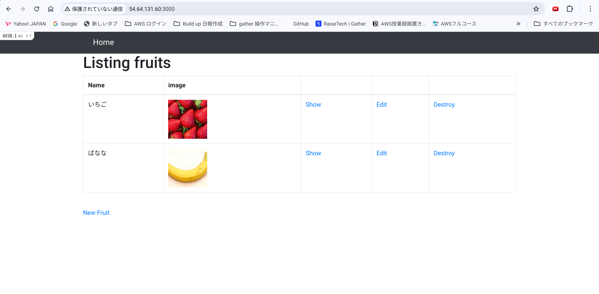

EC2にサンプルアプリケーションデプロイ 
# part1 組み込みサーバ「pumaのみでの起動」まで
## EC2上に環境構築
1 rubyのインスストール
- 必要なライブラリの取得
```sh
sudo yum  -y install git make gcc-c++ patch libyaml-devel libffi-devel libicu-devel zlib-devel readline-devel libxml2-devel libxslt-devel ImageMagick ImageMagick-devel openssl-devel libcurl libcurl-devel curl
```
- rbenvをインストールするためgithubリポジトリコピー
```sh
git clone https://github.com/sstephenson/rbenv.git ~/.rbenv
```
- cloneが終わったらrbenvのPATHを通し、設定を反映させる
```sh
echo 'export PATH="$HOME/.rbenv/bin:$PATH"' >> ~/.bash_profile
echo 'eval "$(rbenv init -)"' >> ~/.bash_profile　
source ~/.bash_profile
```
- rbenvのバージョンを確認。
```sh
rbenv -v
```
- rbenvのPATHの設定が反映されたか確認。
```sh
cat ~/.bash_profile
```
- ruby-biuldをインストール
```sh
#githubリポジトリからコピー
git clone https://github.com/sstephenson/ruby-build.git ~/.rbenv/plugins/ruby-build
```
- ~/.rbenv/plugins/ruby-buildに移動し、インストール実行
```sh
cd ~/.rbenv/plugins/ruby-build
sudo ./install.sh
```
- インストール可能なrubyを確認し、ruby-biuldが正常にインストールされたか確認する
```sh
rbenv install -l
```
- ruby-buildが確認できたので、インストールする
```sh
rbenv install 3.2.3
```
- インストール後、デフォルトで使用するrubyがインストールしたバージョン(3.2.3)になるように変更し、バージョンを確認
```sh
rbenv global 3.2.3
ruby -v
```
2 bundler(2.3.14)のインストール
```
gem install bundler -v 2.3.14
gem list bundler
```
3 railsのインストール
- rails(7.1.3.2)インストールとバージョン確認
```sh
gem install rails -v 7.1.3.2
rails -v
```
4 nodeのインストール
- NodeVersionManager(NVM)を使用してインストールしたいのでまずNVMをインストール
```sh
curl -o- https://raw.githubusercontent.com/nvm-sh/nvm/v0.39.7/install.sh | bash
#変更設定を反映させる
source ~/.bashrc
```
- node(v17.9.1）をインストールとバージョン確認
```sh
nvm install v17.9.1
node -v
```
5 yarnのインストール
- Node Package Manager(npm）を使用してyarn(1.22.19)をインストール
```sh
npm install -global yarn@1.22.19
yarn -v
```
6 EC2(AmzonLinux2022)にmysqlをインストール
```sh
#yumを最新に更新
sudo yum update
#mariadbを削除するため、インストールされているか確認。
rpm -qa | grep -i mariadb
#mariadb及びmariadb関連ファイルを削除
sudo yum remove -y mariadb-*
#yumのリポジトリにmysqlを追加
sudo yum localinstall -y https://dev.mysql.com/get/mysql80-community-release-el7-11.noarch.rpm
#MySQLに必要なパッケージ(mysql-community-server)、(mysql-community-devel)をインストール
sudo yum install -y --enablerepo=mysql80-community mysql-community-server
sudo yum install -y --enablerepo=mysql80-community mysql-community-devel
#MySQLに必要なパッケージを確認
yum list installed | grep mysql
#/var/log/ディレクトリ配下にmysqld.logを作成
sudo touch /var/log/mysqld.log
#MySQLを起動
sudo systemctl start mysqld
#MySQLの状態を確認
sudo systemctl status mysqld
```
- 初期パスワードを設定
```sh
#初期パスワードを確認
cat /var/log/mysqld.log | grep root
#初期パスワードでログイン
mysql -u root -p
#ログイン後、パスワード変更
ALTER USER 'root'@'localhost' IDENTIFIED BY '変更するパスワード';
FLUSH PRIVILEGES;
#ログアウトして再びログインできることを確認
mysql -u root -p
```
7 EC2をRDSに接続
- EC2からRDSに接続
```sh
#mysql -h データベースのエンドポイント -P ポート番号 -u ユーザ名 -p  
#データベースのエンドポイント:database-1.cdisayw68dw6.ap-northeast-1.rds.amazonaws.com
#ポート番号:3306
#マスタユーザ名:admin
mysql -h データベースのエンドポイント　-P 3306 -u admin -p
#マスタパスワードを入力でログインし、接続確認
#show databases;で内容も確認
show databases;
```
## サンプルアプリケーションをクローンし、デプロイする
1 サンプルアプリケーションをEC2上にクローン
```sh
git clone https://github.com/yuta-ushijima/raisetech-live8-sample-app.git
```
2 サンプルアプリケーションのディレクトリに移動しdatabase.ymlを作成し、接続先を編集
```sh
ディレクトリ raisetech-live8-sample-app/configへ移動
cd raisetech-live8-sample-app/config
#database.yml.sampleのコピーでdatabase.ymlファイル作成
cp database.yml.sample database.yml
#viコマンドにてdatabase.ymlの接続先を編集
#database.ymlファイルの16~19行目を接続先をRDSに変更
default: &default
adapter: mysql2
encoding: utf8mb4
pool: <%= ENV.fetch("RAILS_MAX_THREADS") { 5 } %>
username: RDSのマスタユーザ名　admin
password: RDSのマスタパスワード　　セキュリティのため非公開
host    : RDSのエンドポイント　　database-1.cdisayw68dw6.ap-northeast-1.rds.amazonaws.com
port    : 3306
```


3　EC2のセキュリティグループを「インポート3000番」「0.0.0.0./0」を付与
　　
　
環境構築のコマンド
```sh
bin/setup
```
エラー　install missing gems with bundle install が表示
```sh
#bundle install を実施
bundle install
#再度環境構築
bin/setup
```


5　組み込みサーバーの起動
```sh
bin/dev
```
6　ec2のパプリックIPアドレス:3000にアクセス
アプリケーションは表示成功も、画像表示がされない

エラー　Could not open library 'libvips.so.42'　が表示

原因と解決方法

railsのversionが6から7以降にアップグレードした場合、デフォルトでvipsを使う設定になっているので、railsのバージョン7以降でimagemagickを使えるようにするには、
config.active_storage.variant_processor = :mini_magick　を追加する必要がある。

　
```sh
#デフォルトでMiniMagickを使用する設定に変更
cd config/application.rb
#config/application.rb
 class Application < Rails::Application
    # Initialize configuration defaults for originally generated Rails version.
    config.load_defaults 7.0   
#config/Application.rbに config.active_storage.variant_processor = :mini_magick を追加
class Application < Rails::Application
    # Initialize configuration defaults for originally generated Rails version.
    config.load_defaults 7.0    
    config.active_storage.variant_processor = :mini_magick``` ←この1行を追加
```

```sh
#再度実施
bin/dev
```
- 画像表示も確認
