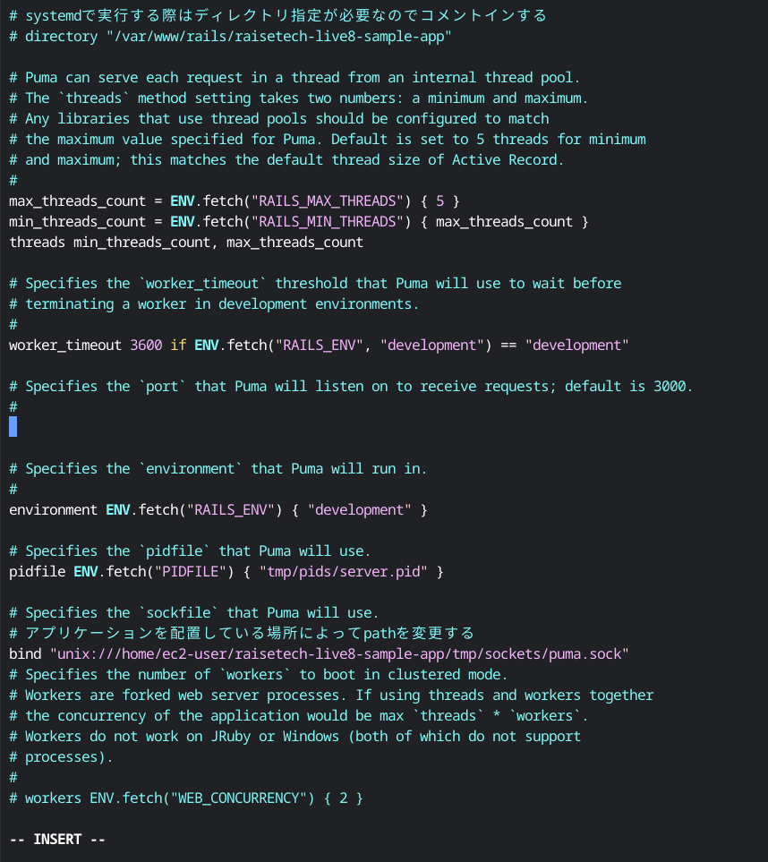
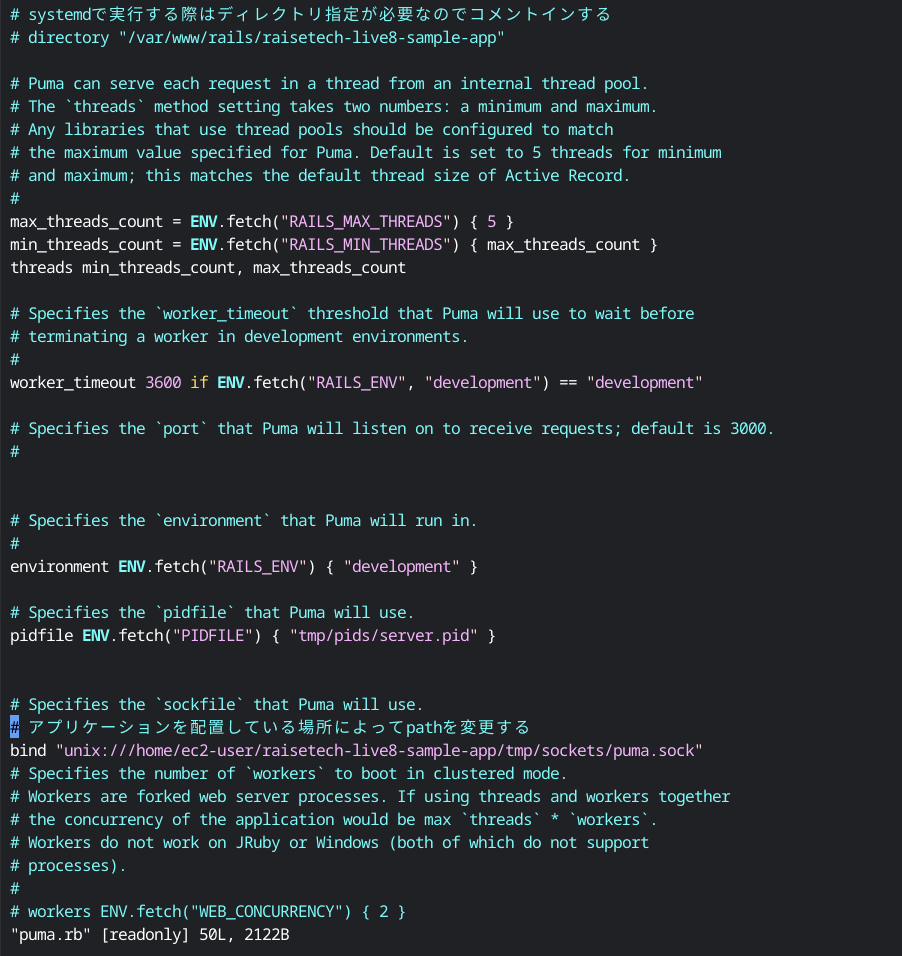
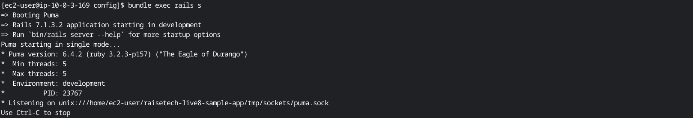
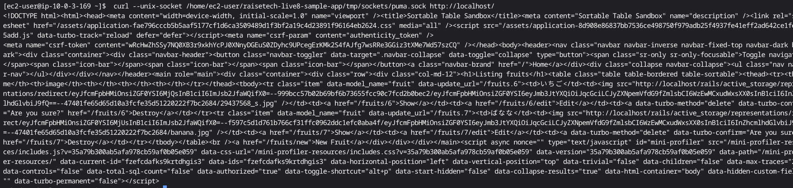
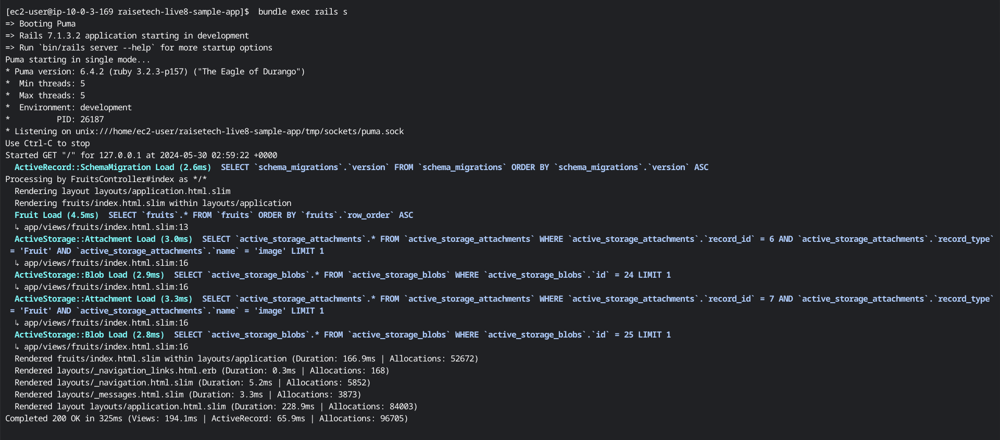
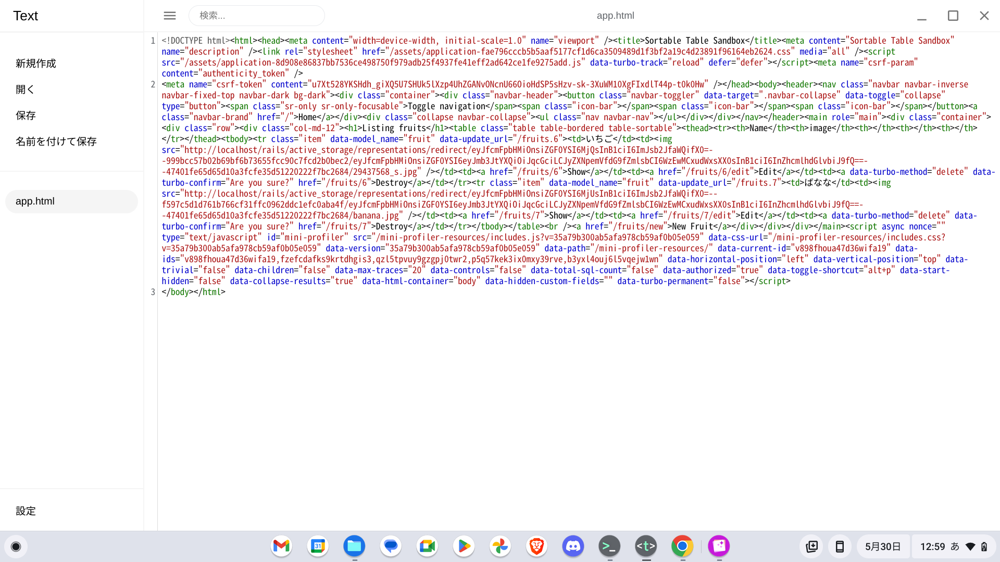
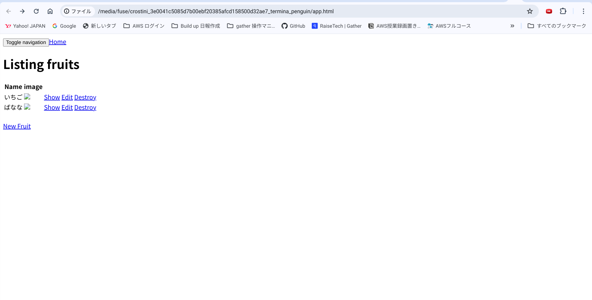

# part2:組み込みサーバー「puma」とUnixSocketを使ったRailsアプリの動作確認まで
- config/puma.rbにて設定を変更
```sh
#デフォルトの設定はTCP3000でのリッスン(受け入れ)
#ポート設定を消去して
#port        ENV.fetch("PORT") { 3000 } ←この1行を消去
#pumaをunixsocketで通信するためソケット先をpuma.sockを設定
#アプリケーションのPATHを確認
bind "unix:///home/ec2-user/raisetech-live8-sample-app/tmp/sockets/puma.sock"
#アプリケーションのPATHが確認できたため保存
```



- 起動し、リッスンがunix:///home/ec2-user/raisetech-live8-sample-app/tmp/sockets/puma.sock"になっているか確認
```
bundle exec rails s
```

- curlを使ってunixsocket通信でアクセス
```
#curl --unix-socket <ソケットへのパス> http://localhost/
curl --unix-socket /home/ec2-user/raisetech-live8-sample-app/tmp/sockets/puma.sock http://localhost/
```

- bundle exec rails s でも確認

200 OKが出ているので、良さそう。
- curlを使って出力した値をhtmlファイルに保存してブラウザで開くことで動作確認。

・ブラウザで開く
