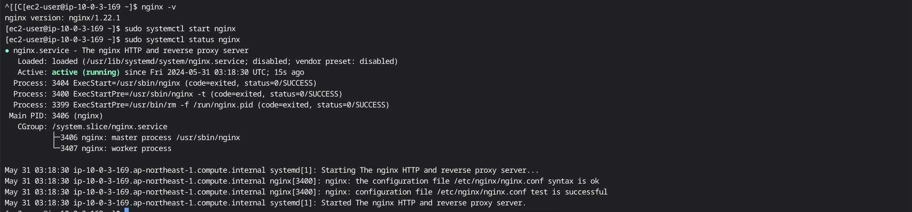
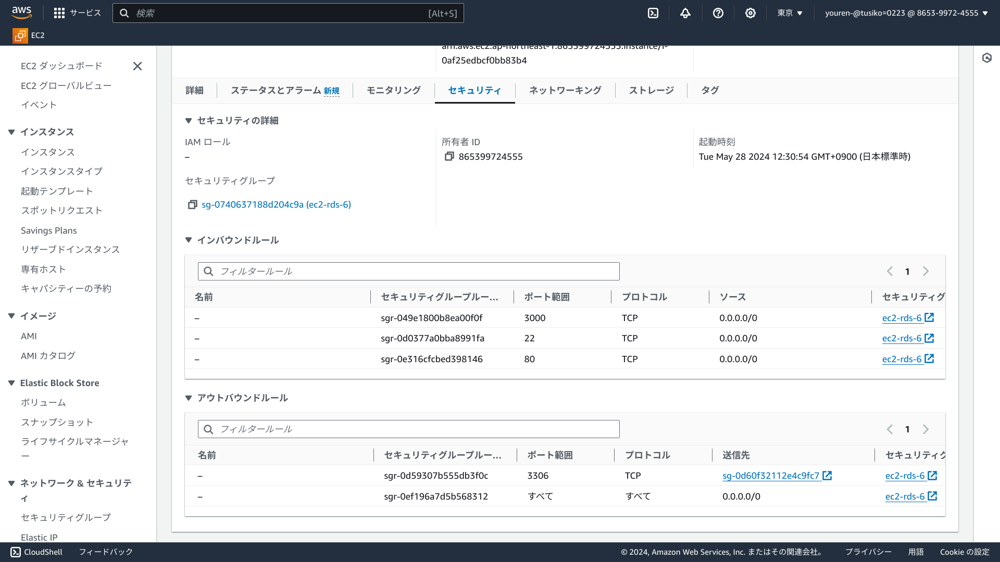
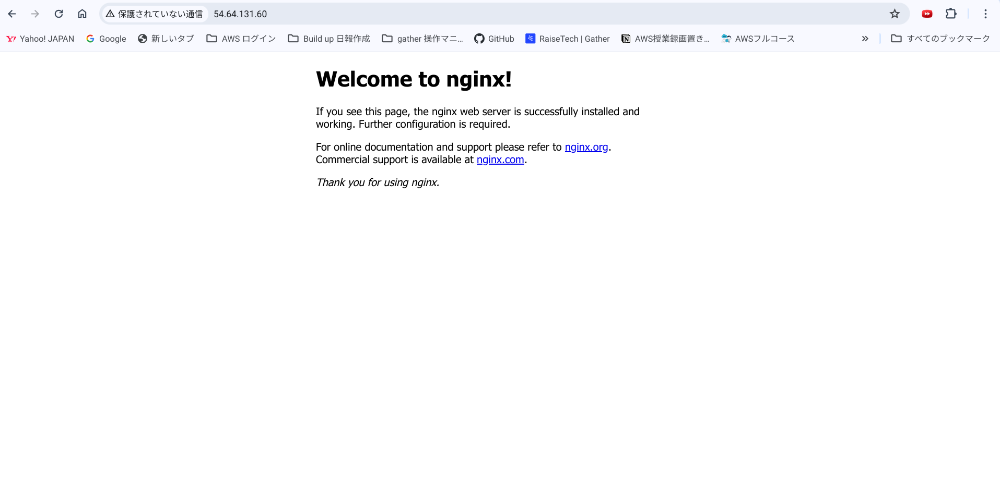

# part3:nginx単体起動における動作確認
- nginxをec2のamazonlinux2にインストール
```
#nginxをamazonlinux2にインストール
sudo amazon-linux-extras install nginx1
#インストールできたらバージョンも確認。
nginx -v
```
- nginxを起動し、状態を確認
```
#nginxを起動させる
sudo systemctl start nginx
#nginxの起動と状態の確認
sudo systemctl status nginx
```

- ec2のセキュリティグループインバウンド80番0.0.0.0/0を追加

- http://パブリックIPv4アドレス/でアクセス
