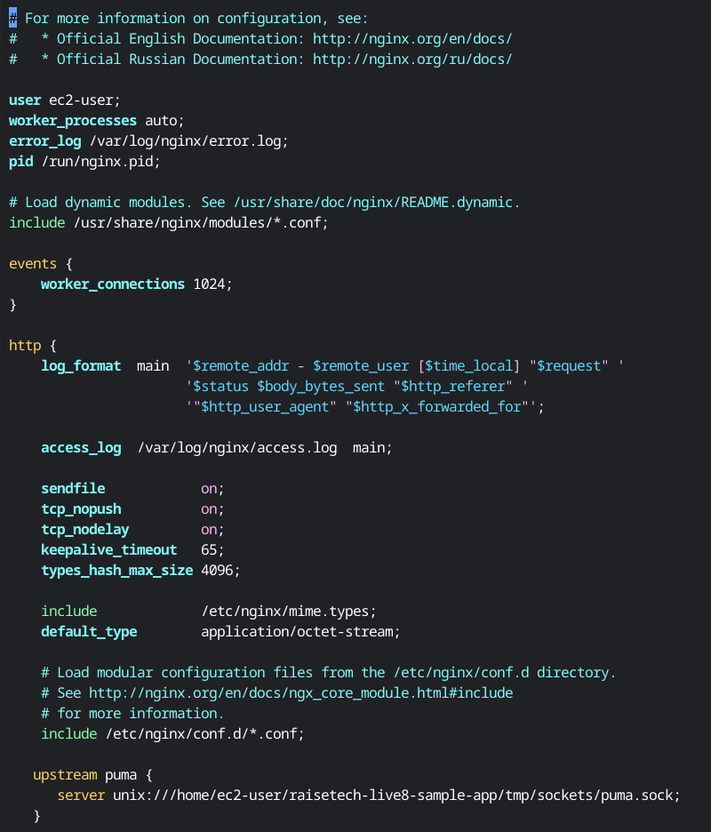
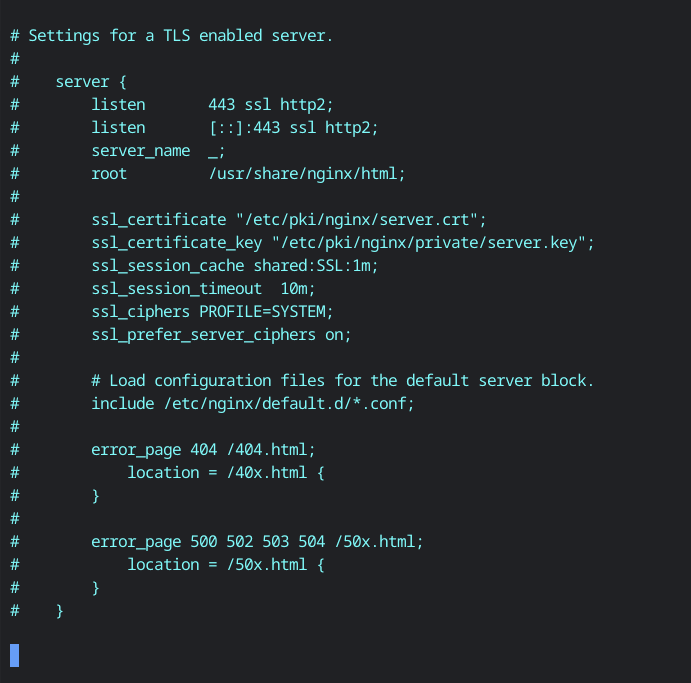

# part4:nginxと組み込みサーバー(puma)をunixsocketを用いてサンプルアプリケーションの動作確認
- /etc/nginx/nginx.confを編集



```sh
#user nginx;からec2-userに変更
user ec2-user;
#バックエンドサーバpumaにunixドメインソケットで通信するよう設定
   upstream puma {
      server unix:///home/ec2-user/raisetech-live8-sample-app/tmp/sockets/puma.sock;
   }
#server_name: _;からlocalhost;に変更
　  server {
        listen       80;
        listen       [::]:80;
        server_name  localhost;
#root;から/home/ec2-user/raisetech-live8-sample-app/public;
　　　　　root        /home/ec2-user/raisetech-live8-sample-app/public;

#try_filesの設定
location / {
     try_files $uri $uri/index.html $uri.html @puma;

     }
#リバースプロキシの設定
location @puma {

            #proxy_read_timeout 300;
            #proxy_connect_timeout 300;
            proxy_redirect off;
            proxy_set_header X-Forwarded-Proto $scheme;
            proxy_set_header Host $http_host;
            proxy_set_header X-Real-IP $remote_addr;
            proxy_pass http://puma;
        }

```
- 設定を反映させて、nginxを再起動。状態を確認
```
#nginxの構文を確認
sudo nginx -t
#nginxの再起動
sudo systemctl restart nginx.service
#nginxの状態を確認
sudo systemctl status nginx.service
```

- 組み込みサーバー(puma)をsystemdによって起動する
- sudo vi /etc/systemd/system下にpuma.serviceファイルを作成し、/samples/puma.service.sampleのファイルをコピー
```sh
#puma.serviceファイルを作成
sudo cat /etc/systemd/system/puma.service
sudo vi puma.service
```
```sh
[Unit]
Description=Puma HTTP Server
After=network.target

# Uncomment for socket activation (see below)
# Requires=puma.socket

[Service]
# Puma supports systemd's `Type=notify` and watchdog service
# monitoring, if the [sd_notify](https://github.com/agis/ruby-sdnotify) gem is installed,
# as of Puma 5.1 or later.
# On earlier versions of Puma or JRuby, change this to `Type=simple` and remove
# the `WatchdogSec` line.
Type=notify

# If your Puma process locks up, systemd's watchdog will restart it within seconds.
WatchdogSec=60

# Preferably configure a non-privileged user
User=ec2-user

# The path to the your application code root directory.
# Also replace the "<YOUR_APP_PATH>" place holders below with this path.
# Example /home/username/myapp
WorkingDirectory=/home/ec2-user/raisetech-live8-sample-app

# Helpful for debugging socket activation, etc.
Environment=PUMA_DEBUG=1

# SystemD will not run puma even if it is in your path. You must specify
# an absolute URL to puma. For example /usr/local/bin/puma
# Alternatively, create a binstub with `bundle binstubs puma --path ./sbin` in the WorkingDirectory
#ExecStart=/<FULLPATH>/bin/puma -C <YOUR_APP_PATH>/puma.rb

# Variant: Rails start.
# ExecStart=/<FULLPATH>/bin/puma -C <YOUR_APP_PATH>/config/puma.rb ../config.ru
ExecStart=/bin/bash -lc 'bundle exec puma -C config/puma.rb'

# Enabled systemd reload
# refs: https://zenn.dev/trysmr/articles/65a6db4deffdbf
ExecReload=/bin/kill -USR2 $MAINPID

# Variant: Use `bundle exec --keep-file-descriptors puma` instead of binstub
# Variant: Specify directives inline.
# ExecStart=/<FULLPATH>/puma -b tcp://0.0.0.0:9292 -b ssl://0.0.0.0:9293?key=key.pem&cert=cert.pem


Restart=always

[Install]
WantedBy=multi-user.target
```
- pumaを起動し、状態を確認
```sh
#systemdに登録
sudo systemctl daemon-reload
#pumaを起動
sudo systemctl start puma
#状態を確認
sudo systemctl status puma
```

- nginxと組み込みサーバー(puma)の起動が確認できたら、パプリックアドレスでアクセス
