# ELB(ALB)を追加して動作確認
- ターゲットグループの作成

- インスタンスにチェックして、ターゲットグループ名「raisetech-task5-target-group」を設定。

- EC2に含まれるVPCで設定。
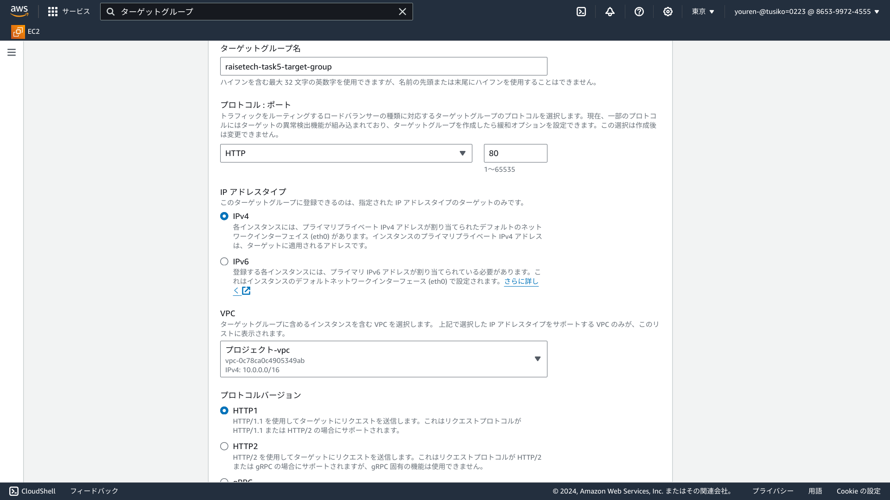

- インスタンスにチャックして、「保留中として以下を含める」を選択。
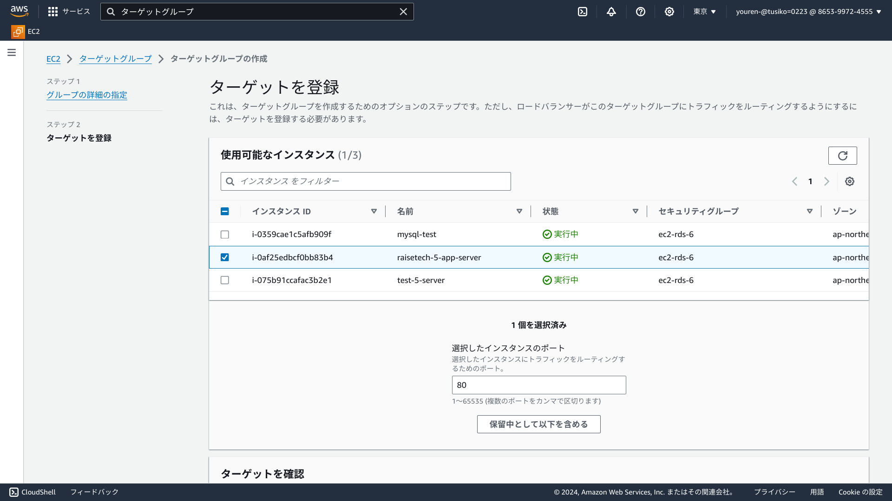
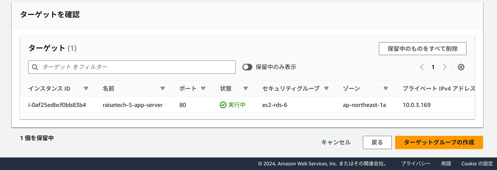

- ターゲットグループを作成できたことを確認。
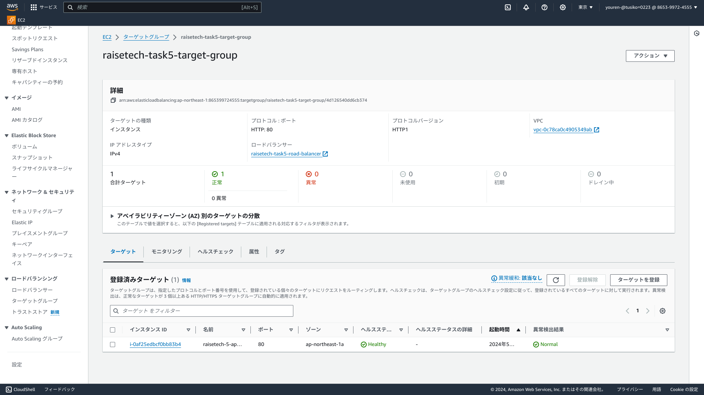

- ロードバランサーの作成
- ロードバランサー名「raisetech-task-road-balancer」を、EC2が存在しているVPCとサブネット内に設定。
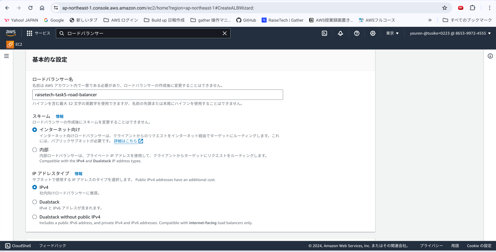

- セキュリティグループとターゲットグループを設定。
 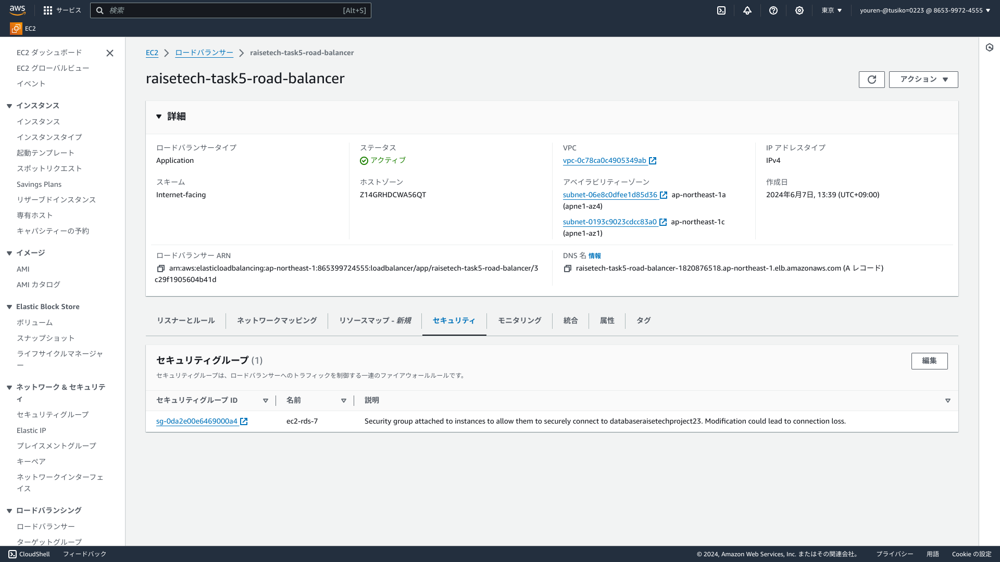
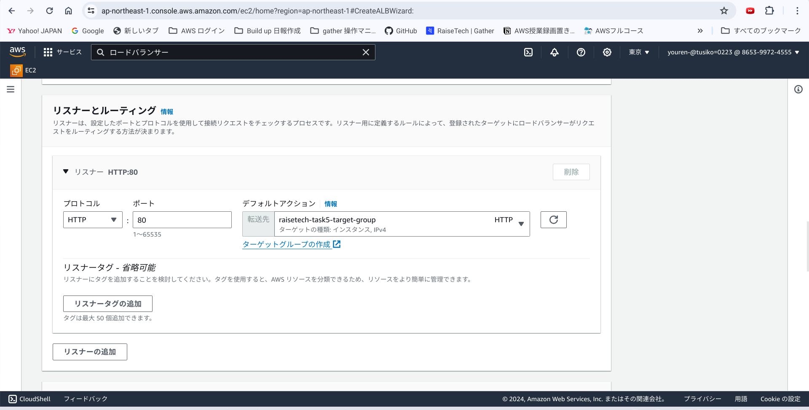

- セキュリティグループのインバウンドとアウトバウンド
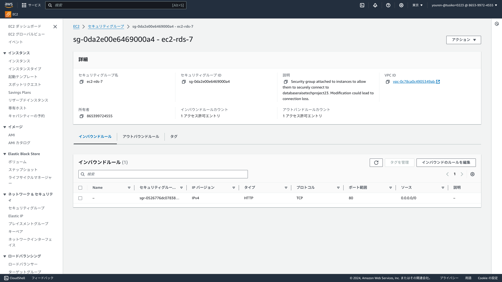
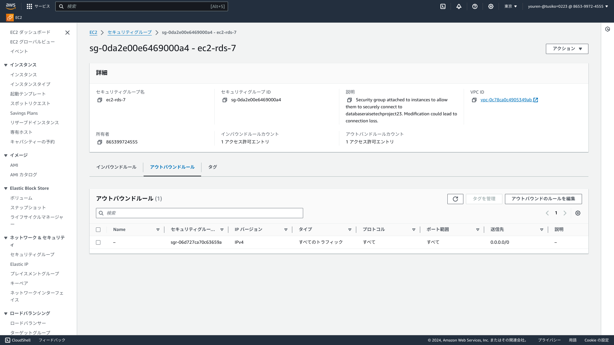

- ターゲットグループのヘルスチェックを確認する。
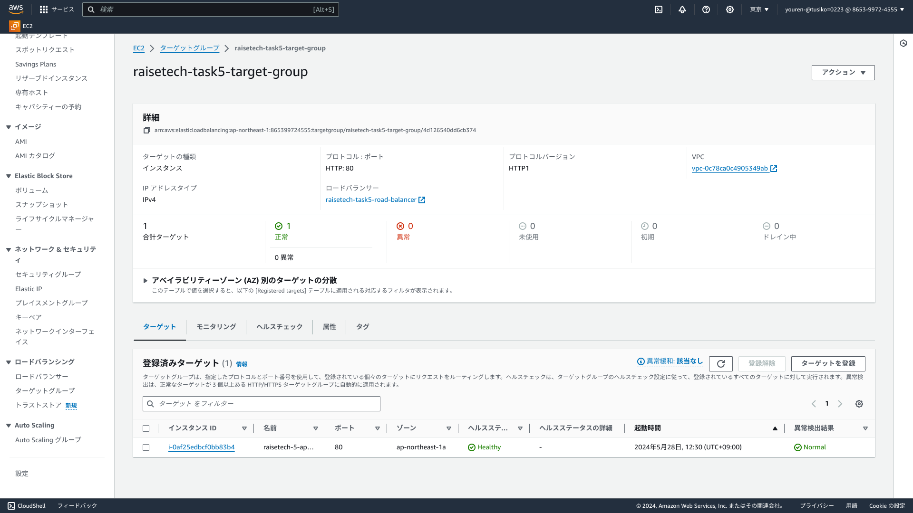

- ロードバランサーでアクセス
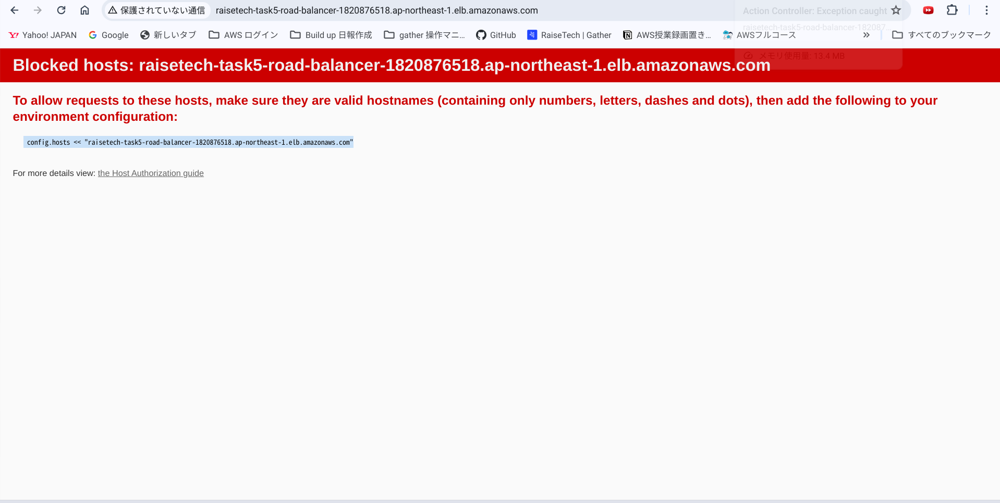

- config.hostsを設定
```sh
#config/envieonments/development.rbにて設定
config.hosts  << raisetech-task5-road-balancer-1820876518.ap-northeast-1.elb.amazonaws.com
```
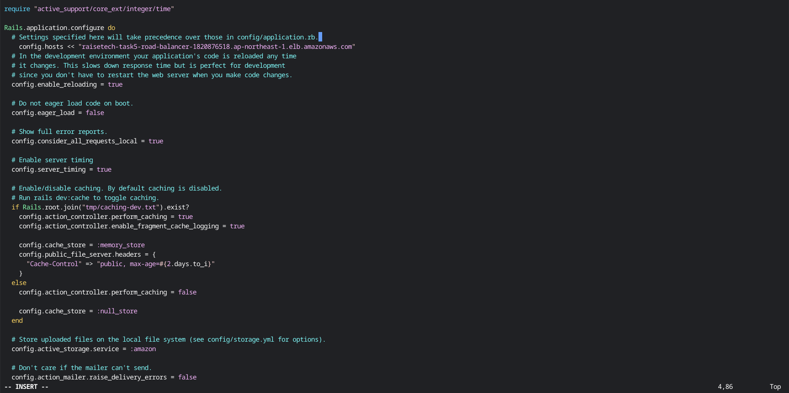

- サーバを再起動して、動作確認
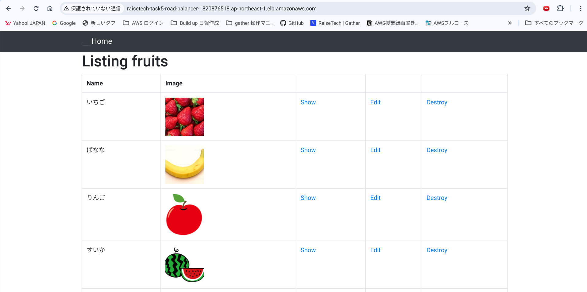