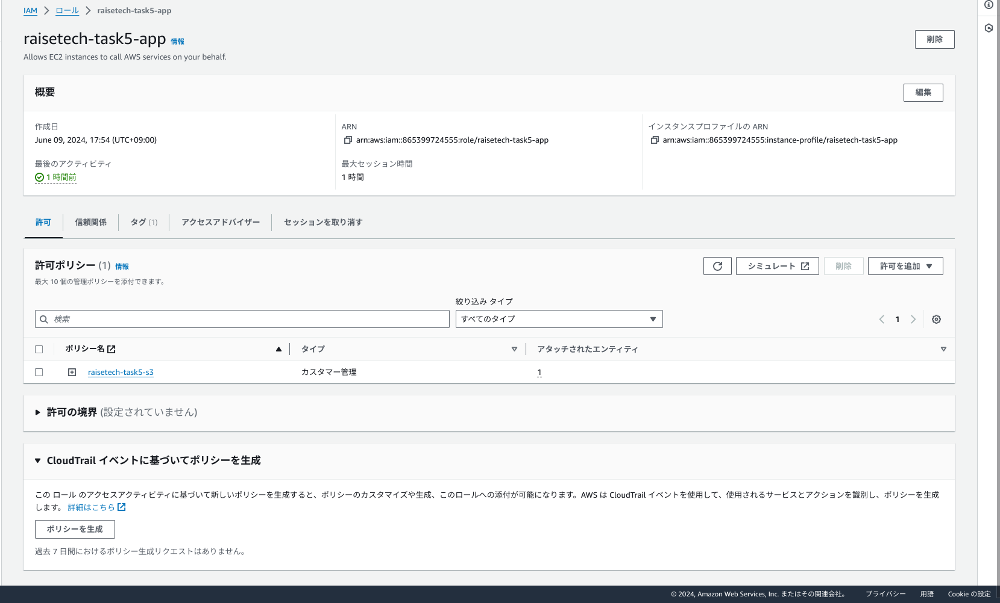

# アプリケーションの画像保存先をS3に変更
- S3バゲットを作成

- ec2にiamロールを付与(ec2がs3バケットにアクセスできるようにするため)
- iamロールを作成




- iamポリシーを作成


- IAMポリシーをiamロールにアタッチ

- ec2に付与


- IAMuserのアクセス権限を確認

- user:第1回課題で作成したAdministratorAccessを付与したIAMuser→権限s3fullaccessも含まれることを確認


- ~~「Access key ID」「Secret access key」の作成~~
~~セキュリティのため値は非公開~~ → 権限管理をEC2にIAMロールの付与することにより不要。

→ S3へのアクセスを許可するIAMロールとIAMポリシーをEC2に付与

GemfIleに gem "aws-sdk-s3", require: false を追加する
再度bundle install

- environments/development.rbにて画像の保存先を変更する local;→amazon;


- storage.ymlにS3の情報を追加
```sh
 amazon:
 service: S3
 region: ap-northeast-1
 bucket: <%= ENV['AWS_S3_BUCKET_NAME'] %>
```

- ~~storage.ymlアクセスキー情報を環境変数で記述~~→IAMロールで権限設定しているので設定不要。

```sh
amazon:
service: S3
region: ap-northeast-1
access_key_id: <%= ENV['AWS_ACCESS_KEY_ID'] %>
secret_access_key:  <%= ENV['AWS_SECRET_ACCESS_KEY'] %>
```

- S3バケット名を環境変数の設定
```sh
vi ~/.bash_profile
# バケット名を追加
export AWS_S3_BUCKET_NAME=my-aws-bucket-task5
# 下記コマンドでも可
echo "export AWS_S3_BUCKET_NAME=my-aws-bucket-task5" >> ~/.bash_profile
```

- git-secretsをインストールしてgithubに誤ってpushしないようにする

```sh
#git-secretsをcloneする
git clone https://github.com/awslabs/git-secrets
＃git-secretsをインストール
cd git-secrets
sudo make install
＃インストールを確認
git secrets -h
```

- nginxとpumaを再起動してアプリケーションの動作確認と保存された画像がs3バケットにも反映されるか確認


- 画像保存時に413 forbitten errorが出たのでnginx.confで画像サイズ変更の設定を追加
デフォルトでは１Mなので、20Mに変更。


- s3保存の画像


- 画像もアプリケーションで保存したものが反映されているか確認


