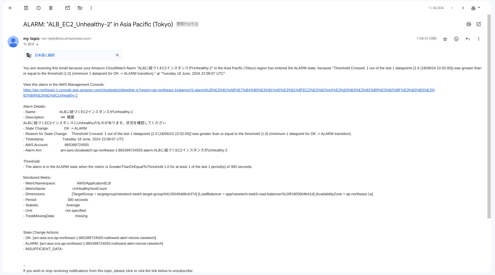
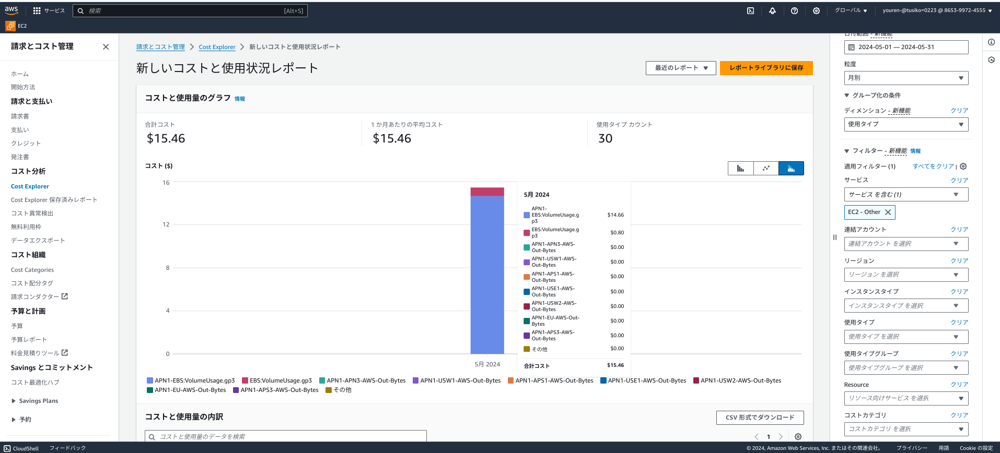
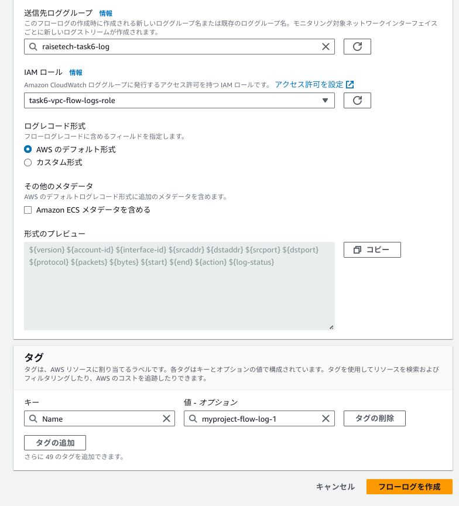
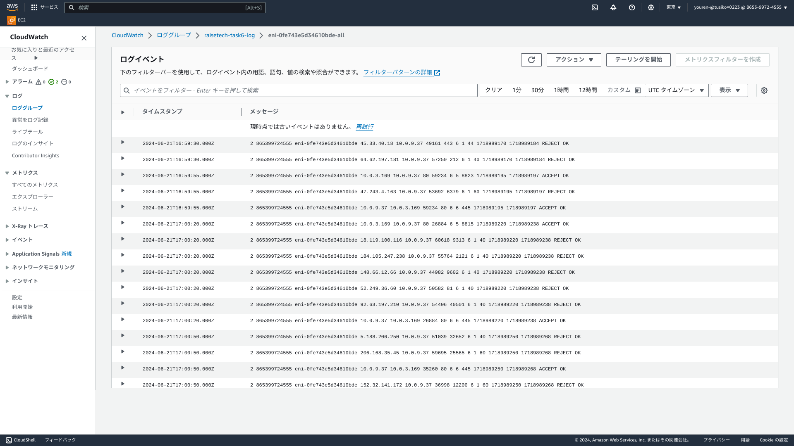

# 第6回課題

## 確認していただきたいこと

1. [最後にAWSを利用した日の記録をCloudTrailのイベントから3つ探し出す](#最後にAWSを利用した日の記録をCloudTrailのイベントから3つ探し出す)
 
2. [CloudWatchアラームにてALBのアラームを設定しメール通知する](#CloudWatchアラームにてALBのアラームを設定しメール通知する)

3. [AWS利用料の見積もりを作成](#AWS利用料の見積もりを作成)

4. [AWS利用料の報告と今後の改善策](#現在のAWS利用料を確認して報告する)

5. [第5回課題で使用したVPCに、VPCフローログを有効化し、保存先をCloudWatchlogsに指定](#第5回課題で使用したVPCにVPCフローログを有効化し保存先をCloudWatchlogsに指定する)

6. [感想](#感想)

### 最後にAWSを利用した日の記録をCloudTrailのイベントから3つ探し出す

1. ConsoleLogin　(IAMユーザー:youren-@tusiko=0223としてmfa認証を使用してAWSにログイン)


2. CreateTrail (IAMユーザー:youren-@tusiko=0223がcloudtrailにて証跡を作成)


3. CreateBucket (CloudTrailにて証跡のログを保存するS3バゲットを作成)


### CloudWatchアラームにてALBのアラームを設定しメール通知する

|設定|設定値|
|----|---- |
|アラーム名|ALBに紐づくEC2インスタンスがUnhealthy-2|
|対象およびメトリクス|ALB/ UnhealtyHostCount|
|閾値およびアクション|平均値300秒あたり1以上(5分ごとに収集されたメトリクスの合計値が閾値を超えたらアラームをトリガーする)|
|通知方法|EメールAmazon SNS を利用|
|アクション|OKアクション及びアラームアクションを付与|


　　　　　　　　　　
- OKアクションの場合


- Eメールにて通知


- webサーバ(nginx)を停止させてターゲットグループunhealthyの状態で確認
```
sudo systemctl stop nginx
sudo systemctl status nginx
```
```
#下記の状態を確認
● nginx.service - The nginx HTTP and reverse proxy server
   Loaded: loaded (/usr/lib/systemd/system/nginx.service; disabled; vendor preset: disabled)
   Active: inactive (dead)

Jun 18 19:16:15 ip-10-0-3-169.ap-northeast-1.compute.internal nginx[22050]: nginx: configuration file /etc/nginx/nginx.conf test is successful
Jun 18 19:16:15 ip-10-0-3-169.ap-northeast-1.compute.internal systemd[1]: Started The nginx HTTP and reverse proxy server.
Jun 18 19:52:33 ip-10-0-3-169.ap-northeast-1.compute.internal systemd[1]: Stopping The nginx HTTP and reverse proxy server...
Jun 18 19:52:33 ip-10-0-3-169.ap-northeast-1.compute.internal systemd[1]: Stopped The nginx HTTP and reverse proxy server.
Jun 18 20:31:22 ip-10-0-3-169.ap-northeast-1.compute.internal systemd[1]: Starting The nginx HTTP and reverse proxy server...
Jun 18 20:31:22 ip-10-0-3-169.ap-northeast-1.compute.internal nginx[22948]: nginx: the configuration file /etc/nginx/nginx.conf syntax is ok
Jun 18 20:31:22 ip-10-0-3-169.ap-northeast-1.compute.internal nginx[22948]: nginx: configuration file /etc/nginx/nginx.conf test is successful
Jun 18 20:31:22 ip-10-0-3-169.ap-northeast-1.compute.internal systemd[1]: Started The nginx HTTP and reverse proxy server.
Jun 18 20:43:10 ip-10-0-3-169.ap-northeast-1.compute.internal systemd[1]: Stopping The nginx HTTP and reverse proxy server...
Jun 18 20:43:10 ip-10-0-3-169.ap-northeast-1.compute.internal systemd[1]: Stopped The nginx HTTP and reverse proxy server.```
```

- alertアクションの場合


- Eメールにて通知


### AWS利用料の見積もりを作成

見積もりURLは[こちら](https://calculator.aws/#/estimate?id=a58b6d23f358212b851086839efed659057decd7)

見積もり内容の詳細
- 第5回課題で構築した環境を想定しております
- リージョン　アジアパシフィック:東京で計算


1. EC2 (アプリケーションサーバー 1台)
2. RDS (データベースサーバー　1台)
3. ELB (ALB　1台)
4. VPC (Public IPv4 Addressを1つ使用)
5. S3  (サンプルアプリケーションの画像保存としてバゲットを作成)

| サービス名                                | 設定の内容 |
| ------------------------------------- | --------------------------------------------------------------------------------------------------------------------------------------- |
| `Amazon EC2` | テナンシー `default` インスタンスタイプ`t2.micro`   vCPUの数 1　<br> メモリGib 1 汎用SSD　`gp2` インスタンスのパフォーマンス　`Low to modarate`| 
| `Amazon RDS for MySQL`| インスタンスクラス　`db.t3.micro`　バリュー 100 ユニット`%Utilized/Month` <br> モデル `OnDemand` デプロイオプション`single-AZ` RDS プロキシ いいえ <br>ストレージタイプ　汎用 SSD `gp2`　ストレージ　20GB |
|`Elastic Load Balancing`| 処理されたバイト 1.08 GBあたり時間　ALB ごとの新しい接続の平均数 1/秒    <br> 平均接続時間 120秒  ALB ごとの 1 秒あたりのリクエスト平均数　5  <br> リクエストごとのルール評価の平均数　60　|
|`Amazon Simple Storage Service (S3)`　|S3 Standard ストレージ10GB　GB当たり月|　　　　　　　　　　　　　　　　　　　　　
|`Amazon Virtual Private Cloud (VPC)`|Public IPv4 Address　使用数　1|　

                     

### 現在のAWS利用料を確認して、報告する

- 現在の利用料
$25.94→4144.56円(6/21の為替で)


- 先月のEC2インスタンスの利用料
$26.80→4,234.83円(6/21の為替で)


- 利用料についての所見
今月、前月ともにAWS利用料が多くかかってしまったため、利用料の原因を分析し、料金を抑える必要があると感じました。

#### 利用料が多くかかってしまった原因

- 第3~5回課題でアプリケーションの動作確認のため、複数台(10台)EC2インスタンスを構築し、EBSボリュームを上げた状態にして停止状態にしていました。
- そのうち9台は停止にしましたが、停止したら料金が発生しないと思いこみ、インスタンスのEBSボリュームを上げた状態で放置してしまいボリュームの削除を行わなかったためその間課金され料金が多く発生してしまいました。

- 利用料がかかっているリソースを確認→EC2インスタンスotherが最もかかっている


- EC2インスタンスother内で費用がかかっている原因を確認
→APN1-EBS:VolumeUsage.gp3に$14.66かかっている



#### 今後の改善策
- 今後、使用しないインスタンスは終了動作を行い、使用する可能性がある停止状態のインスタンスについてはボリュームの削除を行うことを
  徹底すること、使用するリソースに関してはコスト配分タグを配置して料金の発生を抑えるようにしていきます。

- 無料利用枠に収まっているか。→収まっていない


### 第5回課題で使用したVPCに、VPCフローログを有効化し、保存先をCloudWatchlogsに指定する

- VPC Flow Logs のフローログを CloudWatch Logs に発行するための権限を与えるために、IAMロールを作成


```
IAMロールの名称    task6-vpc-flow-logs-role
設定 信頼されたエンティティタイプ→AWS のサービス　
　　 ユースケース→EC2
　　 許可ポリシーは、何も設定せず(後ほど設定)
```
- CloudWatchLogsにログを発行するためにIAMポリシーを作成
```
IAMポリシーの名称　task6-cloudwatchlogs-policy
```

|付与するポリシーアクション| アクションの概要 |
| ---- | ---- |
| CreateLogGroup | 指定された名前で新しいlogグループを作成する権限 |
| CreateLogStream |指定された名前で新しいlogストリームを作成する権限 |
| PutLogEvents|指定されたログストリームに一括のログイベントをアップロードする権限 |
|DescribeLogGroups|リクエストを行っているAWSアカウントに関連付けられているすべてのロググループを返す権限|
|DescribeLogStreams|指定されたロググループに関連付けられているすべてのログストリームを返す権限|


- 作成したIAMロールにIAMポリシーをアタッチ


- ロールの信頼ポリシーを更新

| 更新するロールの信頼関係| 変更箇所 |
| ---- | ---- |
| Principal | "Service":ec2.amazonaws.com"から"vpc-flow-logs.amazonaws.com"に変更。 |


　　
- CloudWatch Logs のロググループの作成
```
ロググループの名称　raisetech-task6-log
```


- VPCフローログを作成するフローログの作成

設定した値を入力

|設定項目 | 設定値 |
| ---- | ---- |
|VPCフローログ名| myproject-flow-log-1 |
|送信先ロググループ| raisetech-task6-log |
|IAM ロール | task6-cloudwatchlogs-policy|




- cloudwatchにてログを確認し、VPCフローログが有効になっているか確認する
VPC内にあるEC2インスタンスをSSH接続して確認




### 感想
- システムの安定稼働のために、logを常にとり、トラブルや障害に常に備えていく考え方が非常に重要であることを学びました。logを常に記録し、予期せぬ異常に備えてcloudwatchでアラーム設定をすること、トラブル、障害が起こったときにlogを基に原因を突き止め、解決していけるよう常にlogが記録できているかを念頭に置いてこれから課題に励みます。

- AWSのコスト管理をすることの大切さを身を持って学びました。あとから、余分なコストがかかってしまったということがないように、タグを使ってプロジェクト毎に管理する、異常値を検知したらCost Anomaly Detection といった目視だけでなくツールも活用してコスト管理を行っていくことで適切なコスト管理ができるようになりたいです。


　　　　　　　　                                                                      


